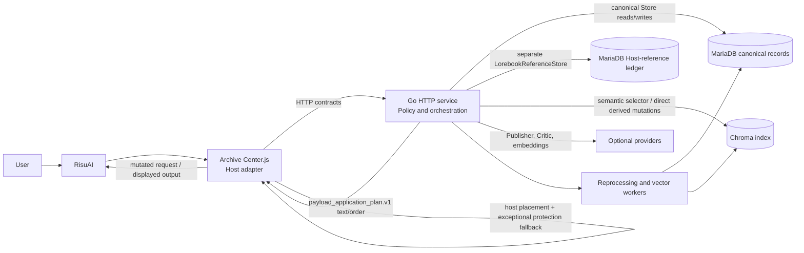
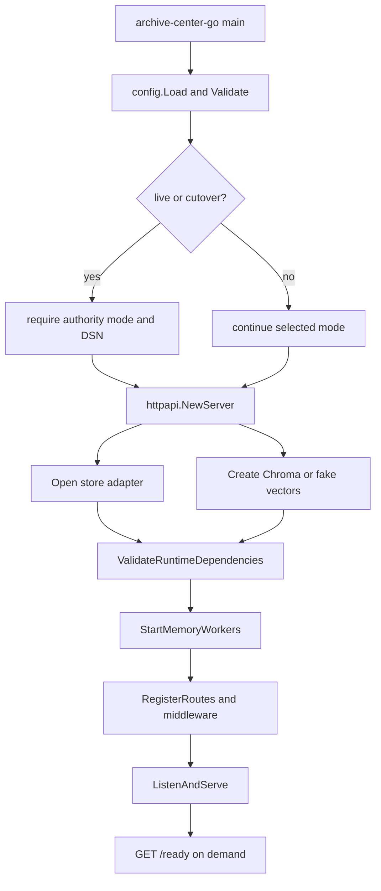
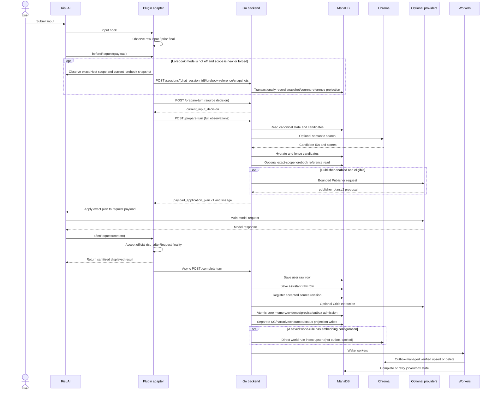
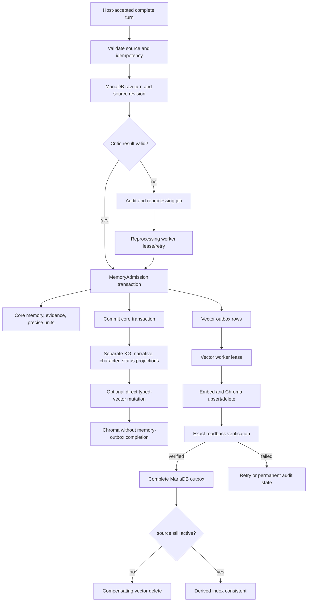

# Archive Center Repository Structure

## 1. Document Status

| Field | Value |
| --- | --- |
| Review date | 2026-08-13 |
| Branch | `agent/fix-voyage-context-batching` |
| Commit | `8f75da855d41874378d37cb9e1744dfa9c6b69ac` |
| Repository root | `C:\Users\com12\Downloads\Archive Center Clean Start 20260626-light\source` |
| Inspection scope | Second-pass refresh of the active dirty-tree RisuAI adapter, Go service, route registration and call sites, configuration, schema/migrations, MariaDB write surfaces, persistence/vector lifecycle, representative tests, build/package scripts, and inactive/generated copies |
| Intentionally excluded | Dependency caches, compiled-binary internals, database data, logs, bulk traversal of generated packages beyond targeted manifest/hash/symbol checks, and unrelated dirty-worktree contents |
| Evidence level | Source-audit evidence only. No claim is made here about a currently loaded RisuAI plugin, a running package, a real MariaDB or Chroma instance, external providers, long-session behavior, or a published release. |
| Confidence | **VERIFIED** for the cited active-source and call-graph claims; **UNKNOWN** for loaded-host, live-dependency, provider/OS, package, and release behavior listed in section 20. |

Status words used in this document have strict meanings:

- **VERIFIED** — directly confirmed in active source code.
- **INFERRED** — strongly supported by code but not proven end to end.
- **UNKNOWN** — the repository does not provide enough evidence.
- **PLANNED** — present only in roadmap/design material, not the active implementation.
- **OBSOLETE** — present in an old, copied, generated, or unreferenced surface rather than the active runtime.

**VERIFIED.** The worktree was already dirty before this audit. Several findings below are mounted or called only in uncommitted/untracked source beyond the recorded HEAD. This document does not treat that fact, generated packages, or previous copies as evidence of a built, loaded, released, or live state. The permanent ownership rules were checked against [AGENTS.md](AGENTS.md) and [the host/backend boundary](docs/permanent-risu-host-backend-boundary.md), but implementation files and their actual callers remain the primary evidence. Line anchors describe this audited dirty-tree snapshot and may move as unrelated work is integrated.

## 2. System Purpose

**VERIFIED.** The active source identifies itself as Archive Center 4.0.0: a RisuAI plugin plus a Go HTTP service. The plugin observes RisuAI turn lifecycle signals, supplies host observations to the backend, applies a backend-produced payload plan, observes the displayed assistant result, and submits an officially accepted `afterRequest` result for persistence. The backend resolves the current input, retrieves and assembles memory/context, optionally obtains and validates a bounded `publisher_plan.v2`, validates completed-turn source lineage, writes through the selected Store, and maintains a derived Chroma search index. An opt-in, default-off Host lorebook path persists a separate reference snapshot/current projection in MariaDB; it is not canonical memory. MariaDB is canonical only in `mariadb_authority`; noop, fixture, read-shadow, and shadow modes do not establish product authority. Evidence: [plugin metadata](Archive%20Center.js#L1-L6), [`registerRisuLifecycleHooks()`](Archive%20Center.js#L4608), [`handlePrepareTurn()`](go-service/internal/httpapi/group_turn_prepare.go#L19), and [`handleCompleteTurn()`](go-service/internal/httpapi/group_turn_complete.go#L117).

**VERIFIED.** The system also exposes store-backed administration, memory explorer, session migration, narrative/persona, original-work reference-library, Host lorebook-reference, timeline/dashboard, status projection, source-discovery/canon-pack, and managed-update routes. These are registered by [`Server.RegisterRoutes()`](go-service/internal/httpapi/server.go#L203-L233). Their presence in source proves route implementation, not plugin invocation, production enablement, canonical-truth authority, or live data quality.

## 3. Current Architecture Summary

**VERIFIED.** Target boundary: `Archive Center.js` is intended to be the RisuAI host adapter. Go owns policy, selection, final budgets, prompt/lane text and ordering, persistence, ViewModels, and stable error decisions. MariaDB is the canonical product store in `mariadb_authority`. The same MariaDB implementation can also hold the deliberately separate, non-canonical Host lorebook observation ledger. Chroma is an optional, derived selector/index and never the authority for a memory or lorebook entry. External LLM and embedding providers are optional backend dependencies configured at runtime.

**VERIFIED.** Normal application path: a successful compact preparation returns `payload_application_plan.v1`; JavaScript validates its version/owner/apply rule, applies the exact Go-produced auxiliary and input-context text, and records `payload_application_observation.v1`. The base auxiliary order is `original_work` → `long_term_memory` → `output_guidance`; `reference_assist` inserts `lorebook_reference` immediately before `output_guidance`. `applyContextInjection()` is active and is host mutation, not evidence that JavaScript owns the lane contents.

**VERIFIED.** Current exceptions: the thin-adapter migration remains incomplete. Active JavaScript still calculates local turn numbers (`nextTurnIndex()`), detects/requests rollback (`checkAndAutoRollback()`), derives the budget observations sent to Go (`estimateAdaptiveInjectionBudgetParts()`), chooses the host insertion position (`resolveAuxiliaryInjectionPlacement()`), and can execute legacy orchestration/read/trace work after an eligible full response when a compatible compact plan is unavailable. Transport failure or an ineligible source decision returns the original payload before that legacy path. On overlap, ambiguous ownership, and intentional-skip paths, `applyProtectionOnlyInjection()` builds and injects JavaScript-owned protection prose without a Go application plan. These are boundary debts. Evidence: [`nextTurnIndex()`](Archive%20Center.js#L20304), [`checkAndAutoRollback()`](Archive%20Center.js#L19932), [`estimateAdaptiveInjectionBudgetParts()`](Archive%20Center.js#L45323), [`resolveAuxiliaryInjectionPlacement()`](Archive%20Center.js#L36184), [`orchestrateTurnHelpers()`](Archive%20Center.js#L28784), and [`applyProtectionOnlyInjection()`](Archive%20Center.js#L30511).

**REMOVED.** The unreferenced legacy `assembleInjectionWithBudget()` JavaScript assembly surface has been deleted. The Go-owned payload application plan remains the active injection budget and assembly owner. [`extractMemoryItems()`](Archive%20Center.js#L20763) is called only to build UI/input-transparency inspection data, not to select final delivered memory.



**VERIFIED.** The diagram describes source ownership, not deployment topology. The two MariaDB nodes are logical authority boundaries, not necessarily different servers. The Host-reference interface is exposed by the direct MariaDB authority Store, not the noop/fixture/dual-write/read-only wrappers. Chroma can be off or provided through several runtime profiles.

## 4. Repository Map

```text
source/
├── Archive Center.js              active RisuAI adapter source (4.0.0)
├── go-service/                    active Go backend source
│   ├── cmd/                       service, package, operator, audit, and smoke executables
│   ├── internal/config/           environment parsing and mode validation
│   ├── internal/dto/              versioned/request DTOs
│   ├── internal/httpapi/          routes, policy, orchestration, workers
│   ├── internal/store/            store interfaces and MariaDB implementation
│   ├── internal/vector/           Chroma/fake vector clients
│   └── internal/packageupdate/    managed-update implementation
├── migrations/                    canonical fresh schema and additive migrations
├── prompts/                       active Critic and Supervisor prompt sources
├── ops/                           package builders, package templates, runbooks
├── scripts/                       developer/start/validation helpers
├── tools/                         installer and operational tooling
├── contracts/                     historical/frozen contract documentation
├── docs/                          architecture, audit, and roadmap documents
├── tests/ and testdata/           non-Go fixtures and test guidance
├── .github/                       CI workflows
├── install-windows.ps1, install.sh public installer entry points
├── _dist*, _release*, _test-builds/ generated/package/test outputs
├── .tmp*, .gocache/               generated caches and scratch data
├── Archive Center 3.4-C.js and Archive Center.js.codex-backup-* inactive copies
└── standalone Recomposer/quality-layer JS files     separate manual plugins
```

| Path | Responsibility and status | Main consumers |
| --- | --- | --- |
| [`Archive Center.js`](Archive%20Center.js) | **VERIFIED.** Active RisuAI hooks, backend transport, exact payload mutation, displayed-output handling, settings UI, and local transient/retry state. | RisuAI; package builders copy this file. |
| [`go-service/cmd/archive-center-go/main.go`](go-service/cmd/archive-center-go/main.go) | **VERIFIED.** Active backend executable startup. | Windows/POSIX packages and local runs. |
| [`go-service/internal/httpapi`](go-service/internal/httpapi) | **VERIFIED.** Active HTTP handlers, prepare/complete orchestration, retrieval, workers, runtime ViewModels. | Backend `main()` through `RegisterRoutes()`/`StartMemoryWorkers()`, plus tests. |
| [`go-service/internal/store`](go-service/internal/store) | **VERIFIED.** Active Store contracts plus MariaDB/noop/fixture implementations. | HTTP policy and workers. |
| [`go-service/internal/vector`](go-service/internal/vector) | **VERIFIED.** Active Chroma and fake vector adapters. | Retrieval, vector outbox worker, and direct projection/admin/migration/reference index paths. |
| [`migrations`](migrations) | **VERIFIED.** The directory contains `001_schema.sql` plus numbered source inputs through `010_lorebook_reference_entries.sql`. **VERIFIED gap:** `001_schema.sql` does not yet contain the four `010` tables even though migration policy requires fresh-schema parity. | `cmd/mariadb-schema`, installers, updater, package builders. |
| [`go-service/internal/httpapi/group_lorebook_reference.go`](go-service/internal/httpapi/group_lorebook_reference.go), [`prepare_turn_lorebook_reference.go`](go-service/internal/httpapi/prepare_turn_lorebook_reference.go), [`go-service/internal/store/lorebook_reference.go`](go-service/internal/store/lorebook_reference.go), [`mariadb_lorebook_reference.go`](go-service/internal/store/mariadb_lorebook_reference.go) | **VERIFIED.** Active dirty-tree Host lorebook snapshot route, non-canonical Store contract, lifecycle, exact/key/lexical search, budget, and optional lane delivery. | `RegisterRoutes()`, `tryPrepareTurn()`, direct MariaDB authority Store. |
| [`prompts/critic_system.txt`](prompts/critic_system.txt), [`prompts/supervisor_system.txt`](prompts/supervisor_system.txt) | **VERIFIED.** Backend prompt inputs. Files containing `복사본` or backup names are not active defaults. | Go prompt loader and package builders. |
| [`ops/build-full-package.ps1`](ops/build-full-package.ps1), [`ops/build-posix-managed-packages.ps1`](ops/build-posix-managed-packages.ps1) | **VERIFIED.** Source tooling that builds binaries, copies plugin/schema/prompts/templates, and writes manifests under `_dist` by default. | Release/package operators. |
| [`contracts`](contracts) | **INFERRED.** Reference material useful for compatibility history; no active service import makes it runtime authority. | Maintainers and tests that intentionally freeze contracts. |
| [`docs`](docs) | Documentation, audits, and future roadmaps. Claims found only here are **PLANNED**, not implementation proof. | Maintainers. |
| `_dist*`, `_release*`, `_test-builds`, `_runtime*`, `.tmp*`, `.gocache` | **OBSOLETE.** Generated, packaged, cached, or test output as active source; some are dirty/untracked. | Build/test tools only. |
| `Archive Center 3.4-C.js`, `Archive Center.js.codex-backup-*` | **OBSOLETE.** Copies relative to the active 4.0.0 source. They can run only if someone separately installs them. | No active source import was found. |
| `AC Recomposer Agent.js` | **VERIFIED.** Optional separately installed consumer of the active transient `archive_center.recomposer_bridge.v1`; it is not copied or auto-loaded by Archive Center package builders. | Manual installation only; live installation is **UNKNOWN**. |
| `Risu Output Quality Layer 2.5.js`, `Risu Recomposer - 복사본.js` | **INFERRED.** Standalone/legacy plugins with no active package-copy or import path found. | Separate manual installation, if any. |

## 5. Runtime and Explicit Tool Entry Points

| Component | Entry file | Entry symbol | Activation method | Responsibility | Evidence | Status |
| --- | --- | --- | --- | --- | --- | --- |
| RisuAI adapter | `Archive Center.js` | async IIFE and `init()` | Plugin load evaluates the file; bottom-level `await init()` | Register hooks/UI, restore local state, sync backend config | [IIFE](Archive%20Center.js#L26), [`init()`](Archive%20Center.js#L55483), [call](Archive%20Center.js#L55806) | VERIFIED |
| RisuAI input observation | `Archive Center.js` | `onInputHook()` | `addRisuScriptHandler("input", ...)` | Cache raw input and observe pending final confirmation | [handler](Archive%20Center.js#L4530), [registration](Archive%20Center.js#L4608) | VERIFIED |
| Pre-model adapter | `Archive Center.js` | `onBeforeRequest()` | `addRisuReplacer("beforeRequest", ...)` | Collect host facts, make source-decision/full `/prepare-turn` calls, apply backend plan to writable payload | [handler](Archive%20Center.js#L37482), [`applyGoPayloadApplicationPlan()`](Archive%20Center.js#L36536) | VERIFIED |
| Optional Host lorebook sync | `Archive Center.js` | `observeLorebookReferenceScope()`, `syncCurrentLorebookReference()`, `postLorebookReferenceSnapshot()` | `tryPrepareTurn()` when mode is not `off`, manual refresh, scope/settings change | Observe the official Host API and transport one scoped snapshot; do not decide recall/delivery | [`tryPrepareTurn()`](Archive%20Center.js#L15233), [`syncCurrentLorebookReference()`](Archive%20Center.js#L15165) | VERIFIED source; UNKNOWN loaded Host |
| Post-model adapter | `Archive Center.js` | `onAfterRequest()` | `addRisuReplacer("afterRequest", ...)` | Normalize visible text, accept official `risu_afterRequest` finality, queue async `/complete-turn`, return display text without waiting | [handler](Archive%20Center.js#L38478) | VERIFIED |
| Backend service | `go-service/cmd/archive-center-go/main.go` | `main()` | Built executable or `go run` | Load/validate config, build server, preflight dependencies, start workers/routes, serve HTTP | [`main()`](go-service/cmd/archive-center-go/main.go#L23-L116) | VERIFIED |
| Schema tool | `go-service/cmd/mariadb-schema/main.go` | `main()` | Windows/POSIX package launchers or an operator invoke it with `--execute` and a DSN | Apply fresh schema and additive compatibility statements; it is not called by the HTTP service startup | [`main()`](go-service/cmd/mariadb-schema/main.go#L96), [Windows launcher](ops/full-package/scripts/start-full-windows.ps1#L1358), [POSIX launcher](ops/full-package-posix/start-full-posix.sh#L481) | VERIFIED |
| Managed updater | `go-service/cmd/archive-center-updater/main.go` | `main()` | Managed package launchers copy/invoke a recovery runner; `/update/apply` only stages the request and asks an authorized service to exit | Verify/apply/commit/rollback managed package state | [`main()`](go-service/cmd/archive-center-updater/main.go#L23), [Windows launcher](ops/full-package/scripts/start-full-windows.ps1#L984-L1091), [POSIX launcher](ops/full-package-posix/start-full-posix.sh#L305-L340), [`handleUpdateApply()`](go-service/internal/httpapi/group_update.go#L243) | VERIFIED |
| Import/migration operators | `go-service/cmd/mariadb-import`, `go-service/cmd/legacy10-migrate` | `main()` | Explicit manual/tool invocation with `--execute` and a DSN | Directly populate MariaDB from validated legacy/export inputs; not mounted service entry points or packaged runtime binaries | [`mariadb-import`](go-service/cmd/mariadb-import/main.go#L210), [`legacy10-migrate`](go-service/cmd/legacy10-migrate/main.go#L70) | VERIFIED |
| Package builders | `ops/*.ps1` | script entry | Operator invocation | Compile Go tools and copy active source payloads to generated output | [`build-full-package.ps1`](ops/build-full-package.ps1#L446-L704), [`build-posix-managed-packages.ps1`](ops/build-posix-managed-packages.ps1#L306-L516) | VERIFIED |

**VERIFIED.** Only the adapter IIFE/hooks and `archive-center-go` are normal application-runtime entries. `mariadb-schema` and `archive-center-updater` are launcher/operator entries. Import, migration, builder, audit, and smoke commands execute only when explicitly invoked and must not be described as active service paths.

## 6. Component Responsibility Matrix

| Component | Owns | Must not own | Inputs | Outputs | Persistent side effects | Relevant paths |
| --- | --- | --- | --- | --- | --- | --- |
| RisuAI adapter | Host lifecycle and official lorebook observation, transport, actual payload mutation, displayed-output replacement, DOM/localization, local retry/UI state | Ranking, canonical turn/range calculation, memory/reference selection, final budgets, prompt prose, persistence policy, ViewModel composition | Risu callbacks, host chat/lorebook snapshots, settings, Go responses | Host observations, HTTP requests, mutated Risu payload, visible status | Plugin storage for settings/queues; no direct DB writes. **VERIFIED:** debt remains in turn/rollback/budget observations, placement, and exceptional protection prose. | [`Archive Center.js`](Archive%20Center.js), [boundary](docs/permanent-risu-host-backend-boundary.md) |
| Go HTTP/policy layer | Validation, current-input/source decisions, canonical and lorebook-reference retrieval, eligibility, dedupe, ranking, budgets, prompt assembly, Publisher/Critic orchestration, stable reason codes | Risu DOM, native lorebook mutation/activation, or direct host payload mechanics | DTOs, canonical/reference reads, vector candidates, runtime config | Versioned plans/ViewModels, persistence commands | Through Store/vector interfaces only | [`internal/httpapi`](go-service/internal/httpapi), [`internal/dto`](go-service/internal/dto) |
| MariaDB store | Canonical raw and structured records, transaction/fence/idempotency enforcement | Semantic relevance policy or UI | Store calls and transactions | Canonical rows, job/outbox rows | Yes; authoritative when `mariadb_authority` is selected. Transaction scope is per store operation, not automatically the whole turn pipeline. | [`internal/store`](go-service/internal/store), [`mariadb_memory_admission.go`](go-service/internal/store/mariadb_memory_admission.go) |
| Host lorebook reference store | Exact Host-scope snapshot ledger and current entry projection | Canonical memory/evidence/entity/relationship/world truth, native Host activation, or Chroma indexing | `lorebook_reference_snapshot.v1` observations | `lorebook_reference_recall.v1` candidates/optional delivered reference text | Yes, in a separate MariaDB transaction and separate `LorebookReferenceStore`; exposed only by direct MariaDB authority in the current factory | [`lorebook_reference.go`](go-service/internal/store/lorebook_reference.go#L91-L96), [`mariadb_lorebook_reference.go`](go-service/internal/store/mariadb_lorebook_reference.go#L198) |
| Chroma adapter | Derived vector document storage and semantic candidate selection | Canonical truth, source acceptance, final eligibility | Embeddings/documents and scoped queries | Candidate IDs/scores; exact-query/list/delete capabilities where the concrete store supports them | Derived index only. It is mutated both by the core-memory outbox worker and by explicitly coded direct index-maintenance/projection paths. | [`internal/vector`](go-service/internal/vector), [`prepare_turn_recall.go`](go-service/internal/httpapi/prepare_turn_recall.go), [`turn_extraction_vector.go`](go-service/internal/httpapi/turn_extraction_vector.go) |
| Reprocessing worker | Retry Critic/derived admission for an accepted source revision | Change raw accepted turn text | Leased MariaDB job and runtime provider config | Core admission plus the same separate post-admission projection writes, or retry/permanent state | Job states, core structured memory, typed projections | [`memory_reprocessing_worker.go`](go-service/internal/httpapi/memory_reprocessing_worker.go#L42-L157), [`saveCriticExtractionArtifacts()`](go-service/internal/httpapi/turn_extraction_persist.go#L97) |
| Vector outbox worker | Materialize embeddings, upsert/delete Chroma, exact-readback verification, retry/compensation for outbox-managed documents | Make Chroma authoritative or imply that it covers every vector mutation | Leased outbox rows and provider config | Verified index mutation and canonical outbox completion | Chroma plus MariaDB outbox status; world-rule/status/admin/migration/reference and compatibility helpers can bypass this worker | [`memory_vector_outbox_processor.go`](go-service/internal/httpapi/memory_vector_outbox_processor.go#L37-L312), [`group_reference_vectors.go`](go-service/internal/httpapi/group_reference_vectors.go#L366-L515) |
| Publisher/Supervisor provider | Return one source-backed, response-scoped `publisher_plan.v2` object containing the required `book_author` and `director` role shapes; either role can have no accepted item | Persist truth, invent defaults/facts, force user action/relationship change/event closure, or directly mutate the main payload | `response_execution_contract.v1` and `supervisor_support_packet.v2` | `supervisor_scene_proposal.v3` carrying `publisher_plan.v2` | None directly; exactly one provider request per Publisher run | [`runSupervisorLLM()`](go-service/internal/httpapi/group_proxy.go#L214), [`buildBoundedSupervisorResult()`](go-service/internal/httpapi/group_proxy.go#L575), [prepare consumer](go-service/internal/httpapi/group_turn_prepare.go#L1057) |
| Critic/extractor provider | Propose structured artifacts from an accepted raw turn | Declare canonical facts without backend validation/admission | Go-built Critic input snapshot | Parsed extraction proposal | None directly | [`turn_extraction_critic.go`](go-service/internal/httpapi/turn_extraction_critic.go), [`group_turn_complete.go`](go-service/internal/httpapi/group_turn_complete.go#L670-L778) |
| Build/update tooling | Produce checksummed/manifested packages from active sources | Become implementation source of truth | Source tree and toolchain | Binaries, copied plugin/schema/prompts, manifests | Generated `_dist`/package contents | [`ops`](ops), [`internal/packageupdate`](go-service/internal/packageupdate) |

## 7. Source-of-Truth Matrix

| Item | Canonicality | Source of truth / owner | Derived or consuming forms | Notes |
| --- | --- | --- | --- | --- |
| Plugin implementation | Canonical source | [`Archive Center.js`](Archive%20Center.js) | Copied plugin in package directories | Package copies are generated. |
| Backend implementation | Canonical source | [`go-service`](go-service) | Compiled executables | Binaries are not editable source. |
| Fresh DB schema | Canonical source | [`migrations/001_schema.sql`](migrations/001_schema.sql) | Installed MariaDB tables | Higher numbered SQL files are additive upgrade inputs. |
| Generated artifacts | Generated | Package/build scripts | `_dist*`, `_release*`, `_test-builds` | Rebuild; do not patch in place. |
| Package manifests | Generated release evidence | Build scripts | `PACKAGE_FILE_MANIFEST.json`, `PACKAGE_MIGRATION_UPDATE.json`, release status | Existence does not prove a package was tested or released. |
| Configuration defaults | Canonical code defaults | [`config.Default()`](go-service/internal/config/config.go#L172-L206) and plugin defaults | Environment, package-rewritten examples, runtime `/config/update` snapshot | Runtime provider config is memory-only; response says `persisted: false`. |
| Raw turn evidence | Canonical runtime record | MariaDB chat logs plus accepted source revision | Critic input, derived memories, audit rows | Assistant text becomes raw canonical evidence only after host/source acceptance and durable save. |
| Effective input | Canonical runtime record | MariaDB effective-input row | Retrieval query/trace | Not interchangeable with arbitrary payload text. |
| Source acceptance/revision | Canonical lifecycle fence | MariaDB `memory_source_revisions` | Worker and vector eligibility | The JavaScript and Go source-acceptance ledgers are correlation/decision state; the durable canonical fence is the MariaDB revision row. Superseded/inactive revisions must not feed current recall. |
| Core admitted memory/evidence/precise units | Canonical accepted derived records | MariaDB `CommitMemoryAdmission()` | Prepare-turn candidates and vector-outbox work | One source-fenced transaction includes the memory row, reconciled direct evidence, precise units, outbox rows, and admission state. |
| Turn-derived KG, subjective/narrative/character/status and other typed projections | Canonical stored projections, subject to each contract's truth flags | Specialized MariaDB Store writers | Prepare-turn inputs, dashboards, maintenance | Written after core admission by separate operations; they are not part of the common-admission atomic transaction. |
| Direct route projections, reference/canon/discovery, and Step-23 records | Persistent MariaDB product records with contract-specific authority | Their route-specific Store writers | UI/read models, reference recall, validation | They can be written without common admission. Step-23 responses explicitly say those auxiliary records are not canonical truth writers. |
| Vector embeddings/documents | Derived index | Chroma. Core memory/direct-evidence/precise admission enqueues MariaDB outbox rows; world-rule extraction, status-schema indexing, admin reindex/orphan cleanup, session migration/rollback/delete, explorer deletion, reference reindex, and non-common-admission compatibility helpers can mutate the relevant Chroma collection directly. | Semantic candidate IDs/scores | MariaDB hydration and active-revision filters re-establish authority. Outbox retry/exact-readback guarantees apply only to outbox-managed documents. |
| In-process caches/ledgers | Temporary/cache | Go server and plugin process | Status/debug/UI | Loss must not redefine canonical history. |
| Plugin storage | Persistent host-local adapter state | Risu plugin storage/local storage | Settings, queues, counters, confirmation observations | Not canonical memory policy. |
| Host lorebook source | Host-owned observed source | RisuAI/PocketRisu official current-scope APIs | MariaDB snapshot ledger/current projection and optional reference lane | Archive Center does not mutate Host lorebook content or infer unobserved scope values. Stored copies remain non-canonical reference data. |
| Host lorebook snapshot/current projection | Persistent non-canonical reference | `LorebookReferenceStore` in direct MariaDB authority mode | `lorebook_reference_recall.v1`, optional Publisher support marked `reference_only` | It is neither the original-work reference library nor a Chroma collection and cannot satisfy canonical `Store`. |
| Documentation | Descriptive or normative | Current source and actual call graph are authoritative for implemented behavior; explicit architecture can constrain future changes without proving implementation | Roadmaps/contracts | Classify current proposals as **PLANNED**, superseded proposals as **OBSOLETE**, and conflicting roadmap intent as **UNKNOWN**. |

## 8. Startup and Initialization Flow



1. **VERIFIED:** [`main()`](go-service/cmd/archive-center-go/main.go#L23-L116) loads and validates environment-derived configuration. Live/cutover has an additional guard requiring MariaDB authority configuration.
2. **VERIFIED:** [`NewServer()`](go-service/internal/httpapi/server.go#L84-L172) selects noop/fixture/MariaDB stores and Chroma/fake vector adapters. A reference vector collection is separate and its failure is designed to be non-blocking.
3. **VERIFIED:** [`ValidateRuntimeDependencies()`](go-service/internal/httpapi/server.go#L60-L80) blocks on configured main Chroma incompatibility/unavailability and, in authority mode, a store-construction error. It does not perform a MariaDB `Ping()`; `sql.Open()` alone does not establish connectivity.
4. **VERIFIED:** [`StartMemoryWorkers()`](go-service/internal/httpapi/memory_reprocessing_worker.go#L42-L68) starts only when the store advertises source lifecycle, job, outbox, and common-admission capabilities. Processing also waits for a synced runtime provider configuration.
5. **VERIFIED:** [`RegisterRoutes()`](go-service/internal/httpapi/server.go#L203-L233) mounts every active route group, including `registerLorebookReferenceRoutes()`, on a private sub-mux, constructs the handler as `CORS(auth(reverse-proxy-base-path(sub-mux)))`, and mounts it at `/` on the main mux before `ListenAndServe`. Request-side execution is therefore CORS → auth → reverse-proxy-base-path → sub-mux.
6. **VERIFIED:** Limitation: `store.OpenMariaDB()` uses `sql.Open()` without a connectivity check; `Ping()` exists separately ([`mariadb.go`](go-service/internal/store/mariadb.go#L24-L57)). The current `/ready` handler treats absence of `StoreOpenError` as store-ready, so an unreachable database can false-green until an actual query. See [`handleReady()`](go-service/internal/httpapi/group_health.go#L99-L129) and the readiness decision ([lines 230–316](go-service/internal/httpapi/group_health.go#L230-L316)).

**VERIFIED.** The plugin has its own initialization: [`init()`](Archive%20Center.js#L55483) registers Risu hooks early, loads persistent settings, syncs runtime configuration to the backend, restores failed/confirmation/persona queues, registers UI controls, and starts non-fatal health/backfill work. Hook registration being requested is not proof that a loaded RisuAI instance accepted or invoked the callbacks.

## 9. End-to-End Turn Flow



**VERIFIED.** **Input stage.** `onInputHook()` is an observation stage, not the final injection stage. `onBeforeRequest()` constructs host/source observations and first calls `/prepare-turn` in source-decision-only mode. Each `tryPrepareTurn()` first attempts lorebook synchronization when the mode is not `off`; the second same-scope call normally reuses the attempt state instead of rereading the Host. If Go does not return an eligible current-input decision, JavaScript preserves the original payload ([source decision](Archive%20Center.js#L37621-L37644), [full decision](Archive%20Center.js#L37778-L37803)).

**VERIFIED.** **Preparation stage.** The full `/prepare-turn` call provides the eligible input and host facts. Go performs Store/vector reads, optional exact-scope lorebook lookup, policy, budgeting, and optional Publisher work. The plugin applies the returned plan at `beforeRequest`, the last supported stage where the outbound payload is writable. Lorebook synchronization/read failure is lane-local and does not abort the main turn.

**VERIFIED.** **Output stage.** `onAfterRequest()` runs on the returned model text and is on the visible-output path. For a save type it normalizes the text, calls `acceptRisuAfterRequestFinal()`, accepts `risu_afterRequest` itself as an official finality source, schedules nested `continueAcceptedFinalPersistence()` with `Promise.resolve().then(...)`, and immediately returns the display text. A later input/host signal is a recovery path for missed/streaming finality, not a prerequisite for every normal save. `/complete-turn` transport failures enter the persistent retry/status path. Evidence: [`onAfterRequest()`](Archive%20Center.js#L38478), [schedule](Archive%20Center.js#L38602-L38610), and [`continueAcceptedFinalPersistence()`](Archive%20Center.js#L38614).

## 10. Memory Retrieval and Injection Flow

**VERIFIED.** The active primary path is `/prepare-turn`; `/search` remains a separate retrieval endpoint and uses the same canonical-vector boundary.

| Stage | Current behavior and owner | Evidence | Status |
| --- | --- | --- | --- |
| Query/current input | Go resolves an eligible current input from typed host/source observations. JavaScript must not infer eligibility on its own. | [`handlePrepareTurn()`](go-service/internal/httpapi/group_turn_prepare.go#L19-L149) | VERIFIED |
| Canonical read | Go reads session-scoped memories, evidence, KG, narrative, persona/private, status, and other projections through the Store. | [prepare Store reads](go-service/internal/httpapi/group_turn_prepare.go#L219-L569) | VERIFIED |
| Semantic search | When configured, Go embeds the query or consumes a supplied vector and asks Chroma for candidates. `top_k` limits vector candidates; it is not the final delivered-memory count. | [`prepareTurnVectorShadow()`](go-service/internal/httpapi/prepare_turn_recall.go#L18-L154), [`selectPrepareTurnMemoryLanesWithVector()`](go-service/internal/httpapi/prepare_turn_recall.go#L880-L1293) | VERIFIED |
| Canonical hydration | Vector hits are hydrated through the selected Store; in authority mode that is MariaDB. Missing, wrong-session, stale, inactive, or superseded source revisions are dropped. | [`filterPrepareTurnActiveSourceRevisionVectors()`](go-service/internal/httpapi/prepare_turn_recall.go#L156-L241), [`prepareTurnHydrateVectorMemoryHits()`](go-service/internal/httpapi/prepare_turn_recall.go#L1956-L2086) | VERIFIED |
| Eligibility | Go scopes canonical reads to the requested session and excludes future-turn, tombstoned/superseded, scope-ineligible, and private-perspective-ineligible material before assembly. | [prepare Store reads and assembly](go-service/internal/httpapi/group_turn_prepare.go#L219-L569) | VERIFIED |
| Duplicate suppression | Go deduplicates repeated selection of the same stored source occurrence/row while preserving distinct occurrences and provenance, then records delivery lineage/status. Exact text alone is not sufficient identity. | [`prepareTurnMemorySourceOccurrenceKey()`](go-service/internal/httpapi/prepare_turn_recall.go#L1554), [`prepareTurnMemoryLaneLines()`](go-service/internal/httpapi/prepare_turn_memory.go#L12) | VERIFIED |
| Ranking/coverage | Query eligibility requires exact phrase or sufficient lexical overlap, with a protected structured-anchor exception. Exact phrase/relevance outrank importance; noneligible, nonprotected rows do not deep/recent-fill. Lexical evaluation still runs after vector success. | [`prepareTurnMemoryRecallEvidence()`](go-service/internal/httpapi/prepare_turn_recall.go#L501), [`selectPrepareTurnMemoryLanesWithVector()`](go-service/internal/httpapi/prepare_turn_recall.go#L880-L1293) | VERIFIED |
| Budgeting | JavaScript supplies settings/runtime-token observations, but Go builds `memory_recall_plan.v1` and clamps the seven ordered `memory_delivery_plan.v1` classes under the final character envelope. Auto mode has no numeric per-class quotas; it selects required then auxiliary material. `core_objective_memory_max_items` caps objective-event summaries only and never forces filler or reinterprets `top_k`. | [`estimateAdaptiveInjectionBudgetParts()`](Archive%20Center.js#L45323), [`buildPrepareTurnMemoryDeliveryPlan()`](go-service/internal/httpapi/prepare_turn_memory_budget.go#L99) | VERIFIED |
| Lorebook reference search/delivery | In non-off modes, Go searches only the exact persisted Host scope by exact phrase, key, and lexical overlap. `search_only` traces candidates without delivery. `reference_assist` requires a fully observed scope, direct key/always-active activation, remaining reference budget, and exact-duplicate suppression; delivered support is `reference_only`. | [`prepareTurnLorebookReferenceSearch()`](go-service/internal/httpapi/prepare_turn_lorebook_reference.go#L301), [`finalizePrepareTurnLorebookReference()`](go-service/internal/httpapi/prepare_turn_lorebook_reference.go#L88) | VERIFIED |
| Ordering/render | Go fixes base auxiliary order as `original_work`, `long_term_memory`, `output_guidance`; `reference_assist` inserts `lorebook_reference` immediately before `output_guidance`. Go concatenates exact lane text, keeps `input_context_text` separate, and emits hashes. It does **not** choose the host message index. | [`buildPrepareTurnPayloadApplicationPlan()`](go-service/internal/httpapi/prepare_turn_render.go#L30), [`attachPrepareTurnLorebookReferenceLane()`](go-service/internal/httpapi/prepare_turn_render.go#L152) | VERIFIED |
| Plugin application | JavaScript rejects a missing/mismatched plan. For a valid plan it inserts the single auxiliary system block first at a JavaScript-selected host position, then inserts the separate input-context system block immediately before the latest user message, and records `payload_application_observation.v1`. | [`applyGoPayloadApplicationPlan()`](Archive%20Center.js#L36536), [`injectAuxiliaryBlock()`](Archive%20Center.js#L36246), [`injectInputContextBeforeUser()`](Archive%20Center.js#L36279) | VERIFIED |

**VERIFIED.** The exact base injection order is Go lane text `original_work` → `long_term_memory` → `output_guidance`. In `reference_assist`, it is `original_work` → `long_term_memory` → `lorebook_reference` → `output_guidance`; outside that mode the lorebook lane is omitted. JavaScript inserts the resulting auxiliary block at its resolved host index, then inserts input context immediately before the latest user. Go owns inner lane order; host mutation is JavaScript-owned, while auxiliary index policy remains boundary debt.

**VERIFIED.** The separate [`handleSearch()`](go-service/internal/httpapi/group_memory_search.go) is registered at `POST /search`. It also treats vector results as selectors, hydrates them from MariaDB, and uses lexical fallback. It must not be interpreted as a second canonical memory store.

**VERIFIED.** Fallback: source-decision or full `/prepare-turn` transport/ineligibility failure returns the original payload before legacy orchestration. After an eligible response, `applyGoPayloadApplicationPlan()` preserves the payload when no valid plan reaches application; the former JavaScript budget assembler has been removed. Separately, overlap/ambiguous/intentional-skip branches call JavaScript-owned `applyProtectionOnlyInjection()`, so “no Go plan always means no mutation” would be false.

**VERIFIED.** Suppression is inspectable through `memory_delivery_lineage`, selection/deferred states, counts, reason codes, and payload observations. Any change that preserves final text but drops lineage is a contract regression. The current `trace_preview` contains a telemetry inconsistency: `/prepare-turn` can call the Publisher, but the preview writes `would_call_llm: false` ([Publisher call](go-service/internal/httpapi/group_turn_prepare.go#L1057), [trace preview](go-service/internal/httpapi/group_turn_prepare.go#L1278-L1289)).

## 11. Output Processing and Commit Flow

1. **VERIFIED:** A model response is not structured truth. `onAfterRequest()` normalizes visible content, binds it to the request/session captured at `beforeRequest`, and accepts official `risu_afterRequest` finality before scheduling persistence.
2. **VERIFIED:** `/complete-turn` validates lifecycle observations, source/session/turn alignment, reroll/replacement state, idempotency key, and conflicting raw text before the persistence boundary. See [`handleCompleteTurn()`](go-service/internal/httpapi/group_turn_complete.go#L117-L605), [`complete_turn_source_acceptance.go`](go-service/internal/httpapi/complete_turn_source_acceptance.go), and [`complete_turn_idempotency.go`](go-service/internal/httpapi/complete_turn_idempotency.go).
3. **VERIFIED:** The raw path is non-atomic. After `context.WithoutCancel`, `persistCompleteTurnRaw()` calls `SaveChatLog(user)` and `SaveChatLog(assistant)` separately. Only after both are durable does `registerCompleteTurnSourceRevision()` run, also separately. A failure can therefore leave a recoverable partial raw pair; idempotent duplicate checks/retry are relied on rather than one enclosing transaction. [`persistCompleteTurnRaw()`](go-service/internal/httpapi/group_turn_complete.go#L1812-L1862), [call and source registration](go-service/internal/httpapi/group_turn_complete.go#L645-L658).
4. **VERIFIED:** Effective input, critic feedback, and audit rows are separate Store writes outside the raw pair and common-admission transaction. `save_ok` marks the handler's raw durability result; it does not prove every derived projection or vector is complete.
5. **VERIFIED:** Critic output is a proposal. The backend builds a bounded Critic input after raw durability, parses/validates the response, and may enqueue a durable reprocessing job on failure rather than fabricate projections ([`group_turn_complete.go`](go-service/internal/httpapi/group_turn_complete.go#L670-L1020)).
6. **VERIFIED:** Only the core is atomic. `commitAcceptedMemoryAdmission()` requires an accepted current source revision. MariaDB `CommitMemoryAdmission()` atomically reconciles the core memory, direct evidence, precise units, vector-outbox rows, and admission-state update in one source-fenced `READ COMMITTED` transaction ([`commitMemoryAdmissionOnce()`](go-service/internal/store/mariadb_memory_admission.go#L116-L233)).
7. **VERIFIED:** The post-admission path is non-atomic. After core admission, `saveCriticExtractionArtifacts()` separately writes precise-memory projections, subjective entity memories, narrative state, story clock, KG triples, character/state artifacts, reversible states, and pruning effects. Any of these can fail after the core transaction commits. [`saveCriticExtractionArtifacts()`](go-service/internal/httpapi/turn_extraction_persist.go#L97-L339).
8. **VERIFIED:** A compatibility path exists. If the Store does not expose common admission, the same function falls back to individual `SaveMemory`, `SaveEvidence`, precise-unit, vector, and projection operations. `mariadb_authority` normally exposes common admission, so this is callable compatibility behavior, not the normal authority path.
9. **VERIFIED:** Failure reporting distinguishes `atomic_rollback` for a failed `CommitMemoryAdmission`, `partial_commit` when some separate derived writes succeeded before another failed, and `no_commit` when none succeeded ([`completeTurnPersistenceRollbackState()`](go-service/internal/httpapi/group_turn_complete.go#L64-L76)).
10. **VERIFIED:** Ownership: the plugin has no direct MariaDB/Chroma client. Active HTTP runtime mutations go through Store/vector interfaces. Operator executables `mariadb-schema`, `mariadb-import`, and `legacy10-migrate` are explicit direct-SQL exceptions outside the service call graph.

### Canonical and persistent write-surface inventory

**VERIFIED.** This inventory covers every mounted handler family or background/operator entry point found capable of mutating MariaDB product state. “Persistent projection” does not automatically mean “canonical truth”; Step-23 DTOs deliberately report their truth-writer flags as false. Preview/search/view-model/provider-only POST routes are excluded because their code does not persist product state.

| Writer location | Mutating entry points or calls | State affected | Status |
| --- | --- | --- | --- |
| Normal completed-turn path | `POST /complete-turn`; `persistCompleteTurnRaw()`, `registerCompleteTurnSourceRevision()`, `SaveEffectiveInput`, feedback/audit, common admission, post-admission writers | Raw turn/effective input, source lifecycle, core admitted memory, typed projections, jobs/outbox/audits | VERIFIED |
| Turn repair/lifecycle routes | `POST /turns/repair-replay`, `POST /effective-inputs`, `DELETE /rollback/{turn_index}`, `POST /turn-workflow/recovery`, and `POST /session-routing/turn-resolution` when it creates/updates a durable host-chat binding | Raw repair, effective input/audit, canonical tail/source invalidation and vector deletion, job/source recovery, session route bindings | VERIFIED — [`group_turn.go`](go-service/internal/httpapi/group_turn.go#L37-L53), [`group_turn_rollback.go`](go-service/internal/httpapi/group_turn_rollback.go), [`turn_workflow_hud.go`](go-service/internal/httpapi/turn_workflow_hud.go#L1624), [`group_turn_range_decision.go`](go-service/internal/httpapi/group_turn_range_decision.go#L390-L480) |
| Direct canonical compatibility routes | `POST /canonical/{chat_session_id}/chat-logs`, `effective-inputs`, `memories`, `evidence`, `kg-triples`, `audit-logs`, `critic-feedback`, `character-events` | Direct canonical table rows; guarded by `usesShadowWriteStore()` | VERIFIED — [`registerCanonicalRoutes()`](go-service/internal/httpapi/group_canonical.go#L13-L36) |
| Explorer mutations | Memory/KG/evidence PATCH, review/revalidate/tombstone/supersede, regenerate, and DELETE/POST-delete routes | Existing memory/evidence/KG rows and regeneration outputs | VERIFIED — [`registerMemoryRoutes()`](go-service/internal/httpapi/group_memory.go#L8-L68) |
| Narrative/session/import routes | Session DELETE; active-scope/director PATCH; storyline PATCH/trust/DELETE; character PATCH/speech/DELETE; world-rule PATCH/trust/DELETE; episode/chapter/arc/saga generation and episode PATCH/DELETE/regenerate/merge; pending-thread mutations; `POST /feedback`; `POST /import/hypamemory` | Session and narrative/persona-adjacent canonical rows, summaries, feedback, imports. `/storylines/sync` and `/world-rules/sync` reject `apply` and are dry-run proposal validators, not writers. | VERIFIED — [`registerNarrativeRoutes()`](go-service/internal/httpapi/group_narrative.go#L12-L107), [`group_session_control.go`](go-service/internal/httpapi/group_session_control.go), [`group_storylines.go`](go-service/internal/httpapi/group_storylines.go#L178-L225), [`group_world_rules.go`](go-service/internal/httpapi/group_world_rules.go#L90-L122), [`group_episodes.go`](go-service/internal/httpapi/group_episodes.go), [`group_audit_feedback_import.go`](go-service/internal/httpapi/group_audit_feedback_import.go) |
| Persona routes | Subjective/persona-memory create/patch/delete/capsule/alias-repair/force-merge and persona-capsule create/delete/attach/detach | Persona capsules, attachments, subjective entity memories and owner identity | VERIFIED — [`registerPersonaRoutes()`](go-service/internal/httpapi/group_persona.go#L15-L33), [`group_persona_capsules.go`](go-service/internal/httpapi/group_persona_capsules.go) |
| Admin/maintenance routes | Database reset, maintenance enqueue/pass, rescan, session normalize/migrate, and dedupe cleanup; reindex/vector-orphan operations directly upsert/delete derived Chroma documents | Broad canonical rows and audits; some operations mutate only the derived vector index. The admin job manager and its DELETE/cancel route are in-process, not MariaDB canonical state. | VERIFIED — [`registerAdminRoutes()`](go-service/internal/httpapi/group_admin.go#L21-L36), [`admin_jobs.go`](go-service/internal/httpapi/admin_jobs.go), [`group_admin_rescan.go`](go-service/internal/httpapi/group_admin_rescan.go), [`group_admin_vector_maintenance.go`](go-service/internal/httpapi/group_admin_vector_maintenance.go) |
| Session migration routes | `migrate-complete`, `migrate-reindex`, `migrate-lock-source`, `migrate-rollback`, `migrate-cleanup-source` (`migrate-preview` is read-only) | Copied/moved session state, migration baselines/locks, cleanup and direct derived-vector upsert/delete | VERIFIED — [`registerSessionMigrationRoutes()`](go-service/internal/httpapi/group_session_migration.go#L80-L86) |
| Status-schema routes | Proposal create/review, registry import, current-value/event/effect writes and effect-state PATCH; proposal/definition routes directly index successfully saved rows when embedding input/config is available | Status proposal/registry/current/history/effect rows plus derived status vectors | VERIFIED — [`registerStatusSchemaRoutes()`](go-service/internal/httpapi/group_status_schema.go#L391-L405), [`group_status_vector.go`](go-service/internal/httpapi/group_status_vector.go#L12-L167) |
| Step-23 projection routes | Consequence, psychology, fork-lineage, theme/offscreen, capture-verification create/status/repair routes | Persistent auxiliary projection/verification records; response contracts mark them as non-canonical-truth writers | VERIFIED — [step-23 registrations](go-service/internal/httpapi/server.go#L221-L227), [`group_step23_fork_lineage.go`](go-service/internal/httpapi/group_step23_fork_lineage.go) |
| Reference-library routes | Work/continuity/document creation and update/delete, extraction/status, timeline normalization, library review/exclusion, auto-review, direct reference-vector reindex/stale deletion, and session binding apply/update/delete | Canonical reference corpus, jobs/review decisions, session bindings; the separately configured Chroma reference collection is derived and its reindex verifies by listing documents, not through the memory outbox | VERIFIED — [`registerReferenceLibraryRoutes()`](go-service/internal/httpapi/group_reference_library.go#L89-L114), [`runReferenceVectorReindex()`](go-service/internal/httpapi/group_reference_vectors.go#L366-L515) |
| Host lorebook snapshot route | `POST /sessions/{chat_session_id}/lorebook-reference/snapshots`; `ApplyLorebookReferenceSnapshot()` | Persistent, non-canonical Host observation ledger plus exact-scope current projection. One default-isolation transaction uses a per-session lock; it has no complete-turn idempotency/source-revision fence, retry queue, outbox, or Chroma mutation. | VERIFIED — [`registerLorebookReferenceRoutes()`](go-service/internal/httpapi/group_lorebook_reference.go#L49), [`ApplyLorebookReferenceSnapshot()`](go-service/internal/store/mariadb_lorebook_reference.go#L198) |
| Canon-pack/source-discovery routes | Canon-pack install/lifecycle, overlay create; discovery job create/resume/complete/admit/repair | Canon registry/pack/overlay, discovery ledgers, admitted reference documents/candidates | VERIFIED — [`registerCanonPackPreviewRoutes()`](go-service/internal/httpapi/group_canon_pack_preview.go#L19-L28), [`registerSourceDiscoveryRoutes()`](go-service/internal/httpapi/group_source_discovery.go#L36-L44) |
| Background workers | Reprocessing job claim/fail/complete and repeated `saveCriticExtractionArtifacts()`; vector-outbox claim/fail/complete | Derived canonical projections/job state; MariaDB outbox status plus derived Chroma documents | VERIFIED — [`memory_reprocessing_worker.go`](go-service/internal/httpapi/memory_reprocessing_worker.go), [`memory_vector_outbox_processor.go`](go-service/internal/httpapi/memory_vector_outbox_processor.go) |
| Explicit operator tools | `mariadb-schema --execute`, `mariadb-import --execute`, `legacy10-migrate --execute` | Schema and direct imported canonical rows | VERIFIED; not active HTTP runtime and not all are packaged binaries |

**VERIFIED.** Physical runtime SQL mutation implementations are concentrated under [`go-service/internal/store/mariadb_*.go`](go-service/internal/store); active `internal/httpapi` code calls Store interfaces rather than importing `database/sql`. Outside that layer, `mariadb-schema` and `mariadb-import` execute SQL directly, while `legacy10-migrate` drives the guarded migration pipeline. SQL-using compare/export/audit and managed-E2E commands are read-only or disposable validation paths, not active product writers.

**VERIFIED.** Other non-canonical mutations: the lorebook snapshot route writes persistent reference observations; `PUT /prompts/{prompt_name}` writes prompt files; `POST /config/update` changes process memory; Chroma mutations change only derived indexes; `/update/download` and `/update/apply` change staged/package files and shutdown state. Chroma is not mutated solely by the outbox worker: direct callers include normal world-rule extraction, status-schema indexing, admin reindex/orphan cleanup, session migration/rollback/delete, explorer document deletion, reference reindex, and the non-common-admission memory/evidence compatibility path ([`turn_extraction_vector.go`](go-service/internal/httpapi/turn_extraction_vector.go#L19-L159)). None of these automatically writes conversational canonical truth. `POST /turns` and `POST /turns/complete` are guard-only compatibility stubs; `/storylines/sync` and `/world-rules/sync` are proposal dry-runs; `POST /rollback/decision`, turn-workflow notices, and admin job cancellation update in-process ledgers only.

## 12. Storage and Indexing Model



**VERIFIED.** **Canonical store.** In `mariadb_authority`, MariaDB owns accepted raw chat/effective input, source revisions, admitted memories/evidence/precise units, KG and typed projections, audits, job ledgers, and vector outbox state. Separately, the migration directory now extends through `010_lorebook_reference_entries.sql`, which creates four non-canonical Host-reference tables. **VERIFIED inconsistency:** `001_schema.sql` lacks those tables despite the fresh-schema parity rule in [`migrations/README.md`](migrations/README.md#L5-L24). The schema tool loads all sorted sibling SQL files when given the directory or `001_schema.sql`, but real fresh-install/upgrade/package parity remains **UNKNOWN**.

**VERIFIED.** **Transaction boundary.** [`CommitMemoryAdmission()`](go-service/internal/store/mariadb_memory_admission.go#L26-L53) retries deadlock-class transaction errors. [`commitMemoryAdmissionOnce()`](go-service/internal/store/mariadb_memory_admission.go#L116-L233) starts a `READ COMMITTED` transaction, locks/checks the source revision, preserves an already committed result for idempotent replay, writes the core memory/evidence/precise-unit projections and outbox rows, updates admission state, and commits those operations atomically. It does not include the separately saved raw pair, effective input/feedback/audits, KG, narrative, character, status, or other typed projections.

**VERIFIED.** **Asynchronous derivation.** Reprocessing and the core memory/evidence/precise vector-outbox operations are MariaDB-backed, leased jobs. They are woken after complete-turn work and drain eligible items while runtime provider configuration is synced. A stale source revision is rejected rather than re-derived into current state. This statement does not cover the direct typed/admin/migration/reference vector calls listed above.

**VERIFIED.** **Index consistency.** For outbox-managed documents, the vector worker embeds if necessary, mutates Chroma, requires exact readback, then completes the MariaDB outbox row. If an upsert succeeded but the source fence became stale before completion, it attempts a compensating delete ([`processClaimedMemoryVectorOperation()`](go-service/internal/httpapi/memory_vector_outbox_processor.go#L186-L312)). Direct vector helpers such as normal world-rule extraction and status-schema indexing report an immediate result/warning but have no durable memory-outbox retry or exact-readback step; admin/reference reindex paths implement their own verification, while migration and delete paths have route-specific status handling. Temporary MariaDB/Chroma divergence is therefore possible on more than the outbox retry path, but Chroma must never promote itself to canonical truth.

**VERIFIED.** **Recovery.** The common writer freezes the first committed extraction/result hash for deterministic replay; a failed core admission can stage the successful Critic result, and workers retry without re-sampling an already committed extraction. This recovery guarantee does not prove automatic reconciliation of every post-admission typed projection after a partial commit. Representative evidence is [`resolveCommittedMemoryAdmissionExtraction()`](go-service/internal/httpapi/turn_memory_admission.go#L16-L79) and [`mariadb_memory_admission_test.go`](go-service/internal/store/mariadb_memory_admission_test.go#L345-L409).

**VERIFIED.** **Host-reference persistence.** `ApplyLorebookReferenceSnapshot()` atomically creates/finds the exact scope, appends a snapshot, records entry revisions, and updates that scope's current projection. A complete observed snapshot replaces the current projection; a complete empty snapshot clears it; consent revocation clears it; partial/unavailable or older authoritative observations are retained without replacing a newer current projection. This path has no automatic freshness/TTL gate, complete-turn idempotency ledger, durable retry queue, source-revision fence, or vector update. Admin reset includes its tables, but `DeleteSession()` and `sessionMigrationManifestV1` omit them; that omission is **VERIFIED**, while intended delete/migrate retention behavior is **UNKNOWN**.

## 13. API and Hook Contracts

### RisuAI hooks

| Hook | Exact registration | Contract |
| --- | --- | --- |
| Input | `addRisuScriptHandler("input", onInputHook)` | Observation/correlation only; not the outbound payload mutation point. |
| Before request | `addRisuReplacer("beforeRequest", onBeforeRequest)` | Only supported main-request payload application point; callback observation is recorded before use. |
| After request | `addRisuReplacer("afterRequest", onAfterRequest)` | Visible output normalization, official `risu_afterRequest` finality acceptance, and non-blocking persistence scheduling; must preserve request/session coordinates captured earlier. |
| Unload | `onUnload(removeRegisteredRisuHooksOnUnload)` | Removes registered handlers and local lifecycle state. |

**VERIFIED.** Source registration awaits `input` first, `beforeRequest` second, and `afterRequest` third, then registers the unload cleanup. The expected turn callback sequence is input observation → before-request mutation → after-request finality/output handling. Registration order and source intent do not prove that a loaded host invokes every callback in that order; that remains a live-RisuAI question. Evidence: [`registerRisuLifecycleHooks()`](Archive%20Center.js#L4608-L4648).

### Important backend route groups

| Routes | Owner and purpose | Primary evidence |
| --- | --- | --- |
| `GET /health`, `GET /ready`, `GET /version`, `POST /config/update` | Liveness, dependency readiness, build/runtime identity, in-memory provider settings | [`group_health.go`](go-service/internal/httpapi/group_health.go) |
| `POST /prepare-turn` | Current-input decision, canonical/vector recall, policy, budget, optional Publisher, final application plan | [`group_turn_prepare.go`](go-service/internal/httpapi/group_turn_prepare.go) |
| `POST /complete-turn`, `GET /complete-turn/request-status` | Source acceptance, raw durability, Critic/admission handoff, transport idempotency | [`group_turn_complete.go`](go-service/internal/httpapi/group_turn_complete.go), [`complete_turn_idempotency.go`](go-service/internal/httpapi/complete_turn_idempotency.go) |
| `POST /search` (`handleSearch()`) and retrieval/explorer reads | Canonical-hydrated search and read models | [`group_memory_search.go`](go-service/internal/httpapi/group_memory_search.go) |
| `/canonical/{chat_session_id}/...` | Direct Store-backed read/write compatibility surfaces; write handlers are guarded by `usesShadowWriteStore()` | [`registerCanonicalRoutes()`](go-service/internal/httpapi/group_canonical.go#L13-L36), [`usesShadowWriteStore()`](go-service/internal/httpapi/server.go#L175-L193) |
| `POST /sessions/{chat_session_id}/lorebook-reference/snapshots` | Validate and persist an exact Host lorebook observation through the separate `LorebookReferenceStore`; not a canonical-memory or vector writer | [`registerLorebookReferenceRoutes()`](go-service/internal/httpapi/group_lorebook_reference.go#L49), [`LorebookReferenceStore`](go-service/internal/store/lorebook_reference.go#L91-L96) |
| `/admin/...`, `/sessions/...`, narrative/persona/reference/status routes | Maintenance, migration, read models, and the distinct write families inventoried in section 11 | [`RegisterRoutes()`](go-service/internal/httpapi/server.go#L203-L232) |
| `/step22/...` | Read-only adoption/validation preview in the mounted code | [`group_step22_adoption_gate.go`](go-service/internal/httpapi/group_step22_adoption_gate.go#L33) |
| `/step23/...` | Persistent auxiliary projection/verification records; their response contracts do not claim canonical-truth-writer authority | [step-23 registrations](go-service/internal/httpapi/server.go#L221-L227) |
| `POST /turns`, `POST /turns/complete` | **OBSOLETE.** Compatibility stubs that call `writeShadowGuard()` and do not persist; the active completed-turn entry is `POST /complete-turn` | [`group_turn.go`](go-service/internal/httpapi/group_turn.go#L57-L95) |
| `/proxy/plugin-main` | Provider-neutral proxy/Publisher request handling | [`group_proxy.go`](go-service/internal/httpapi/group_proxy.go) |

### Version, hash, ordering, and error constraints

- DTO owners are [`dto.PrepareTurnContractRequest`](go-service/internal/dto/prepare_source_contract.go#L45), [`dto.PrepareTurnRequest`](go-service/internal/dto/types_gen.go#L925), and [`dto.M4CompleteTurnRequest`](go-service/internal/dto/types_gen.go#L624). Do not recreate these contracts in JavaScript.
- Current memory contracts are `memory_recall_plan.v1` and `memory_delivery_plan.v1` ([`prepare_turn_memory_budget.go`](go-service/internal/httpapi/prepare_turn_memory_budget.go#L9-L11)); final host application remains `payload_application_plan.v1` ([`prepare_turn_render.go`](go-service/internal/httpapi/prepare_turn_render.go#L30-L149)). JavaScript rejects an incompatible application version.
- Current optional guidance uses `supervisor_support_packet.v2`, `response_execution_contract.v1`, `supervisor_scene_proposal.v3`, and `publisher_plan.v2`. Go accepts only `ready`/`partial` source-backed items, renders one Go-owned block in `compact`, `standard`, or `explicit` form, and gives the plan no truth/write authority ([`buildBoundedSupervisorResult()`](go-service/internal/httpapi/group_proxy.go#L575), [`supervisorSceneProposalGuidanceItems()`](go-service/internal/httpapi/prepare_turn_render.go#L335)).
- Current Host-reference contracts are `lorebook_reference_scope.v1`, `lorebook_reference_snapshot.v1`, and `lorebook_reference_recall.v1` ([`prepare_turn_lorebook_reference.go`](go-service/internal/httpapi/prepare_turn_lorebook_reference.go#L15-L20), [`lorebook_reference.go`](go-service/internal/store/lorebook_reference.go#L9-L17)). They convey reference-only observations, not canonical admission.
- Persistence/index lifecycle contracts include `memory_source_revision.v1` and `memory_vector_outbox.v1` ([`memory_derivation.go`](go-service/internal/store/memory_derivation.go#L12-L13)).
- Complete-turn uses an idempotency key/recorded-response ledger. A key conflict is non-retryable; unknown or retryable outcomes can be queried without blindly duplicating writes ([`complete_turn_idempotency.go`](go-service/internal/httpapi/complete_turn_idempotency.go#L257-L410)).
- Memory lane order, item text, source refs, budgets, serialization, and hashes are compatibility-sensitive. A change must update backend producer, adapter consumer, DTO/contract tests, and payload-observation tests together.
- HTTP errors use stable code/message JSON helpers and middleware. CORS defaults to `*`; bearer enforcement is optional and must be explicitly enabled ([`server.go`](go-service/internal/httpapi/server.go#L291-L367)).

## 14. Configuration and Runtime Modes

**VERIFIED.** Configuration is loaded from environment variables by [`config.Load()`](go-service/internal/config/config.go#L210-L346), validated by [`Config.Validate()`](go-service/internal/config/config.go#L413-L454), and supplemented by the plugin's runtime-only `/config/update` call. No secret values are reproduced here.

| Area | Current options / representative variables | Behavior |
| --- | --- | --- |
| Bind and browser access | `AC_BIND_ADDR`, `AC_ALLOWED_ORIGINS` | Default bind is loopback `127.0.0.1:28080`; default allowed origins are `*`. |
| Authority mode | `AC_MODE` = `shadow`, `live`, `cutover` | `live`/`cutover` require the explicit authority guard. |
| Store mode | `AC_STORE_MODE` = `noop`, `dual_shadow`, `mariadb_shadow`, `fixture_shadow`, `mariadb_read_shadow`, `mariadb_authority` | Only `mariadb_authority` is product authority. `mariadb_shadow` is a noop-primary/MariaDB-shadow dual writer; `mariadb_read_shadow` wraps MariaDB read-only; fixture/noop are not authority. |
| Runtime profile | `AC_RUNTIME_PROFILE` = `client_only`, `core_lite`, `vector_external`, `vector_local_native`, `full_local` | Validated against vector mode. |
| Vector mode | `AC_VECTOR_MODE` = `off`, `fallback`, `external`, `local_native`, `local_proot`, `bundled` | Chroma endpoint/collections are separate for session and reference data. |
| MariaDB | `AC_MARIADB_DSN` | Required for MariaDB authority; value is secret and must not be logged or documented. |
| Chroma | `AC_CHROMA_*` | Controls enablement, endpoint, session collection, reference collection, and timeouts. |
| Providers | runtime plugin settings plus `AC_EMBED*`, Critic/Publisher settings | `/config/update` stores provider keys/endpoints/models only in process memory; response reports `persisted: false`. |
| Publisher presentation | `none`, `weak`, `medium`, `strong`, `extreme`, `maximum`; formats `compact`, `standard`, `explicit` | Strength changes current-response explicitness only. `none` disables the Publisher call, not memory/secret guards. Format changes Go rendering only. |
| Host lorebook reference | Plugin setting `off` (default), `search_only`, `reference_assist` | Only direct `mariadb_authority` currently exposes `LorebookReferenceStore`; other Store modes return lane-local `unavailable`. |
| Prompts | `AC_PROMPT_DIR` and prompt filenames | Packages copy `critic_system.txt` and `supervisor_system.txt`. |
| Lifecycle/retry | prune mode, Critic ledger flags, embedding/Critic timeouts, vector retry limit | Controls admission and worker eligibility/retry behavior. |
| Auth | bearer token and enforcement variables | Disabled by default; required for some managed/update deployments. |
| Updates | `AC_UPDATE_*` | Stable channel and update enablement defaults are set in Go config. |
| Build identity | `AC_BUILD_VERSION` and plugin constants | Go, plugin, and package-builder defaults are `4.0.0`; the plugin channel is `release`. |

**VERIFIED.** The repository-root [`.env.example`](.env.example), Go default, Windows/POSIX package-builder defaults, and packaged env template now use `4.0.0`. A built package must still be checked independently because the builders stamp copied metadata and `AC_BUILD_VERSION` at build time.

## 15. Generated, Packaged, Legacy, and Experimental Files

**VERIFIED.** Do not normally edit any `_dist*`, `_release*`, `_test-builds`, `_runtime*`, cache, binary, package-manifest, or copied package file. The Windows builder defaults to `_dist`, compiles only `archive-center-go`, `archive-center-updater`, and `mariadb-schema`, copies the entire active migration directory plus the active plugin/prompts/templates, then generates package/migration/release manifests ([migration inventory](ops/build-full-package.ps1#L278-L322), [copy](ops/build-full-package.ps1#L530-L534)). The POSIX builder performs the corresponding cross-build/copy process. Other `go-service/cmd` programs are operator/audit/smoke/import tools and are not active service code merely because they contain `main()`.

**OBSOLETE.** Smoke/E2E executables and test fixtures are not active runtime entry points. Some can mutate explicitly provisioned disposable databases or vectors when run with execution flags; that is test activity, not evidence that they can write the deployed product's canonical state through the normal service.

Source-to-output rules:

| Output | Rebuild from |
| --- | --- |
| Packaged `Archive Center.js` | root active [`Archive Center.js`](Archive%20Center.js) |
| `bin/archive-center-go*` | [`go-service/cmd/archive-center-go`](go-service/cmd/archive-center-go) |
| `bin/archive-center-updater*` | [`go-service/cmd/archive-center-updater`](go-service/cmd/archive-center-updater) |
| `bin/mariadb-schema*` | [`go-service/cmd/mariadb-schema`](go-service/cmd/mariadb-schema) |
| Packaged SQL | [`migrations`](migrations) |
| Packaged prompts | active files in [`prompts`](prompts) |
| Package manifests/checksums | `ops/build-*.ps1` scripts |

**VERIFIED.** `Archive Center 3.4-C.js`, timestamped `Archive Center.js.codex-backup-*`, and `prompts/critic_system.pre-first-compression-20260808.txt` are **OBSOLETE** historical copies for active runtime defaults. The inert `_step18MarkerSurface` historical evidence object has been removed. `AC Recomposer Agent.js` is an optional, separately installed consumer of the active transient Recomposer bridge, but no package-copy/autoload step was found; live installation is **UNKNOWN**. Other standalone Recomposer/quality-layer copies remain **INFERRED** separate/legacy.

**VERIFIED.** A newly run package builder will inventory and copy migration `010`, but the existing `_test-builds/Pre-4.0.0-windows-test` manifest ends at `009`; its plugin copy lacks lorebook symbols and differs in hash from active source. That generated artifact is stale evidence for this dirty tree. Also, `build-full-package.ps1` always rewrites the copied display label and `AC_BUILD_VERSION`, but rewrites plugin `//@version` and `const VERSION` only when the requested package version is strict `x.y.z`. A label such as `Pre-4.0.0` can therefore coexist with plugin runtime version `3.9.11`; verify each identity separately.

## 16. Failure and Fallback Behavior

| Failure | Current behavior | Visibility / safety | Status and evidence |
| --- | --- | --- | --- |
| Backend unavailable/timeout | `bridgeFetch()` returns `null`. The source-decision and full `/prepare-turn` calls each use one `bridgeFetch`, not the retry wrapper; either failure/ineligibility preserves the original payload and returns before legacy orchestration. Legacy reads are reachable only after an eligible response without a compatible compact plan. Complete-turn transport has its own persistent retry/status path. | Main generation fails open. Separately coded overlap/ambiguous/intentional-skip branches can still inject the JavaScript protection-only block. | VERIFIED — [`bridgeFetch()`](Archive%20Center.js#L13303), [source/full decisions](Archive%20Center.js#L37621-L37803), [`applyProtectionOnlyInjection()`](Archive%20Center.js#L30511) |
| MariaDB open/connectivity failure | `sql.Open` errors are caught at construction, but unreachable DB connectivity is not probed at startup/readiness. Later route queries fail. | Open errors block authority startup; unreachable-host false-green is not safely visible in `/ready`. | VERIFIED limitation — [`mariadb.go`](go-service/internal/store/mariadb.go#L24-L57), [`handleReady()`](go-service/internal/httpapi/group_health.go#L99-L129) |
| Main Chroma unavailable/incompatible | If enabled, preflight/readiness checks health and collection compatibility; startup fails or readiness degrades/blocks. Prepare/search can use lexical/canonical fallback depending on mode/path. | Visible in readiness and retrieval trace; must not widen eligibility. | VERIFIED — [`ValidateRuntimeDependencies()`](go-service/internal/httpapi/server.go#L60-L80), [`prepareTurnVectorShadow()`](go-service/internal/httpapi/prepare_turn_recall.go#L18-L154) |
| Reference Chroma unavailable | Separate reference health degrades without blocking main readiness or normal turn persistence. | Explicit degraded fields; tested as non-blocking. | VERIFIED — [`server_preflight_test.go`](go-service/internal/httpapi/server_preflight_test.go#L90-L179) |
| Malformed Publisher/Critic response | Publisher makes exactly one provider request. Empty/container/strict-JSON/schema/no-valid-item/valid-empty states produce no fabricated guidance; only source-backed `publisher_plan.v2` `ready`/`partial` items render. Critic failure does not fabricate projections. | Publisher fails open while base memory remains; Critic can leave raw evidence durable and enqueue reprocessing. | VERIFIED — [`runSupervisorLLM()`](go-service/internal/httpapi/group_proxy.go#L214-L318), [prepare statuses](go-service/internal/httpapi/group_turn_prepare.go#L1057-L1143) |
| Lorebook Host API, snapshot Store, or read unavailable | Synchronization records a warning when possible and the turn continues. Go returns lane-local `unavailable`; non-authority Store modes lack `LorebookReferenceStore`. The adapter marks a same scope attempted before transport and has no durable retry queue, so non-forced automatic attempts are suppressed until scope/settings/process state changes. | No lorebook lane/Publisher support is delivered; last confirmed current projection can remain stored after unavailable/partial observation. An ambiguous retry could append another snapshot because the route generates a fresh ID. | VERIFIED — [`syncCurrentLorebookReference()`](Archive%20Center.js#L15165), [`prepareTurnLorebookReferenceSearch()`](go-service/internal/httpapi/prepare_turn_lorebook_reference.go#L301), [`handleLorebookReferenceSnapshot()`](go-service/internal/httpapi/group_lorebook_reference.go#L62) |
| Missing/incompatible payload application plan | Normal application returns the original payload with a skipped/error observation; the unreferenced legacy assembler is not used. | Fail-open generation without Go memory/guidance. JavaScript protection-only exceptions remain possible on separately coded skip/overlap paths. | VERIFIED — [`applyGoPayloadApplicationPlan()`](Archive%20Center.js#L36536) |
| Client disconnect during accepted complete-turn | Backend detaches canonical work from request cancellation with `context.WithoutCancel`. | Protects accepted writes; idempotency/status endpoint handles ambiguous transport outcomes. | VERIFIED — [`group_turn_complete.go`](go-service/internal/httpapi/group_turn_complete.go#L605-L610), [`complete_turn_idempotency.go`](go-service/internal/httpapi/complete_turn_idempotency.go#L380-L410) |
| Raw or post-admission write failure | Raw user/assistant/source writes and post-admission typed projections are separate operations. A later failure can leave a durable prefix. | Complete-turn reports diagnostics and `partial_commit`/`no_commit`; core admission alone reports `atomic_rollback` on its transaction failure. Recovery coverage for every typed projection is not proven. | VERIFIED — [`persistCompleteTurnRaw()`](go-service/internal/httpapi/group_turn_complete.go#L1812-L1862), [`completeTurnPersistenceRollbackState()`](go-service/internal/httpapi/group_turn_complete.go#L64-L76), [`saveCriticExtractionArtifacts()`](go-service/internal/httpapi/turn_extraction_persist.go#L97-L339) |
| Worker/provider failure | Lease is failed to retryable or permanent state according to configured limits; Critic reprocessing and vector outbox remain in MariaDB. | Traceable job/outbox state; terminal states require operations review. | VERIFIED — [`memory_reprocessing_worker.go`](go-service/internal/httpapi/memory_reprocessing_worker.go#L118-L157), [`memory_vector_outbox_processor.go`](go-service/internal/httpapi/memory_vector_outbox_processor.go#L186-L312) |
| Direct Chroma mutation failure | Normal world-rule/status and compatibility vector helpers record an immediate skip/failure/warning after the canonical row may already exist; they do not enqueue a durable memory-outbox retry or require exact readback. Admin/reference/migration/delete routes expose their own failure/status behavior. | MariaDB remains authoritative, but a derived document can be missing or stale until an explicit maintenance/reindex path repairs it. | VERIFIED — [`upsertDerivedArtifactVector()`](go-service/internal/httpapi/turn_extraction_vector.go#L81-L159), [`indexStatusSchemaProposal()`](go-service/internal/httpapi/group_status_vector.go#L12-L89), [`runReferenceVectorReindex()`](go-service/internal/httpapi/group_reference_vectors.go#L366-L515) |
| Stale reroll/edit source | Source revision fence rejects derivation; vector upsert completion can compensate with delete. | Prevents stale derived memory from becoming current. | VERIFIED — [`complete_turn_source_revision.go`](go-service/internal/httpapi/complete_turn_source_revision.go), [`memory_vector_outbox_processor.go`](go-service/internal/httpapi/memory_vector_outbox_processor.go#L300-L312) |
| Missing runtime provider sync | Workers defer processing; prepare Publisher/Critic features degrade rather than inventing output. | Runtime status should expose config sync; queues remain durable. | VERIFIED — [`processMemoryWorkerWake()`](go-service/internal/httpapi/memory_reprocessing_worker.go#L118-L157) |

## 17. Common Mistakes and Architectural Guardrails

Only the document-wide evidence labels are used here. **VERIFIED** followed by “risk” means the risky surface or behavior is directly present; **VERIFIED** followed by “guard” means the active path contains the stated protection; **INFERRED** followed by “risk” means the failure is plausible from the connected surfaces but not reproduced end to end.

| # | Title and classification | Affected paths / why dangerous | Safe rule | Required validation |
| --- | --- | --- | --- | --- |
| 1 | Editing generated output — **VERIFIED** risk | `_dist*`, `_release*`, `_test-builds`, package copies exist beside sources; an edit can disappear on rebuild. | Edit active root/plugin, Go, migration, prompt, or build source only. | Rebuild and compare manifest/source identity. |
| 2 | Multiple implementation copies drift — **VERIFIED** risk | `Archive Center 3.4-C.js`, backups, and packaged copies can be mistaken for active 4.0.0. | Treat root `Archive Center.js` and `go-service` as active. | Check package copy hash/version against active source. |
| 3 | JavaScript duplicates backend policy — **VERIFIED** risk | Active adapter still calculates turn/range/rollback, budget observations, placement, legacy orchestration reads, and exceptional protection prose. The old unreferenced JavaScript budget assembler has been removed. | Move/repair policy in Go and remove replaced JS in the same bounded slice. | JS line delta, `node --check`, backend contract and payload fidelity tests. |
| 4 | Adapter bypasses Go plan — **VERIFIED** exception | Normal `applyContextInjection()` requires `payload_application_plan.v1`, but `applyProtectionOnlyInjection()` directly injects JavaScript-owned prose on several active fallback branches. | Preserve exact Go-plan application and migrate/remove the exceptional policy path. | Output-fidelity/lineage tests plus live fallback payload inspection. |
| 5 | Vector data treated as canonical — **VERIFIED** guard; **VERIFIED** consistency gap | Prepare/search hydrate Chroma candidates through the selected Store and fence source revisions. Core admitted documents use an outbox, but several typed/admin/migration/reference paths mutate Chroma directly without the same durable retry/exact-readback contract. | Chroma selects; the authority Store decides existence, scope, lifecycle, and text. Reconcile and observe direct index writers independently. | Stale/missing/wrong-session vector tests, direct-writer failure/reindex tests, and real Chroma test. |
| 6 | Unverified text promoted to truth — **VERIFIED** guard | Source acceptance, Critic parsing, evidence, and common admission separate raw evidence from structured proposals. | Preserve raw accepted evidence; require typed validation and provenance. | Reroll/correction/conflicting-output tests. |
| 7 | Evidence or correction provenance lost — **VERIFIED** guard | Evidence rows and source revisions are carried into core admission/recall. | Never write memory without source/session/revision/evidence identity. | Direct evidence, user-correction, supersession tests. |
| 8 | Writes bypass the common commit path — **VERIFIED** risk | Direct canonical, explorer, admin, narrative, persona, status, Step-23, original-work reference, Host-reference snapshot, canon-pack, source-discovery, migration, and operator-tool writes coexist with `/complete-turn`. The Host-reference route is persistent but deliberately non-canonical. | Normal turn-derived memory must use accepted `/complete-turn` and common admission; keep Host-reference observations in their separate Store; narrowly authorize/test every other writer family. | Route auth, authority-mode, source-fence, audit, reference-boundary, and direct-tool tests. |
| 9 | Duplicate native and Archive Center injection — **INFERRED** risk | Native context plus Archive Center lanes can overlap despite Go dedupe and source refs. | Dedupe on stable provenance/text and record actual payload hash/lineage. | Live Risu payload capture with native context enabled. |
| 10 | Wrong Risu hook stage — **VERIFIED** guard | Input observes, beforeRequest mutates, afterRequest accepts visible output finality; moving these breaks finality or payload control. | Keep those stage responsibilities fixed. | Loaded-plugin hook observation and actual payload/display lineage. |
| 11 | Fallback reported as normal success — **VERIFIED** risk | MariaDB connectivity is not pinged, so `/ready` can report ready before the first failed query. | Readiness must verify the authority DB, and degraded states must remain explicit. | Unreachable-MariaDB preflight/readiness regression. |
| 12 | Suppression hides valid memory — **VERIFIED** guard | Go emits delivery lineage, reasons, counts, and deferred/suppressed state. | Never dedupe/suppress without stable, inspectable reason/source refs. | Coverage, protected-memory, dedupe, and lineage tests. |
| 13 | Async race, duplicate, or partial commit — **VERIFIED** mixed boundary | Source fences, idempotency, the core-admission transaction, leases, and outbox-managed vector exact-readback provide guards; raw pair/source registration, post-admission projections, and direct vector writes remain separate and can diverge or report `partial_commit`. | Do not describe the whole turn or whole index as atomic; preserve durable diagnostics and add reconciliation for separate writers where required. | Raw-row failure, deadlock, replay, stale source, post-admission/direct-vector failure, and worker-crash tests. |
| 14 | Configuration drift — **VERIFIED** risk | Source defaults and templates are aligned at 4.0.0, but package builders still rewrite copies and a stale generated package can advertise another version. | Validate source defaults, templates, package rewrite, and runtime status together. | Package smoke test and `/version`/`/ready` identity comparison. |
| 15 | Roadmap described as implementation — **VERIFIED** risk | Active source uses `memory_recall_plan.v1`, `memory_delivery_plan.v1`, `payload_application_plan.v1`, and `publisher_plan.v2`. Older integrated roadmap prose still proposes recall/injection v2, while the current 4.0 roadmap retains v1 delivery/application. | Classify each contract independently from its active producer, validator, consumer, and caller; do not infer a shared version. | Contract-version grep, negative compatibility tests, and end-to-end payload evidence. |
| 16 | Obsolete code mistaken as active — **VERIFIED** risk | Old plugin copies and inert marker surfaces can be mistaken for active runtime; the unreferenced JavaScript budget assembler has now been removed. | Prove activation/import/caller/package copy before using a file or symbol as evidence. | Entry-point, call-site, and build-input inventory. |
| 17 | Schema/API/plugin/docs inconsistency — **VERIFIED** risk | `trace_preview.would_call_llm` is hard-coded false even when Publisher may have run; some route comments still say shadow while authority mode is included. | Version and test observable contracts; update comments/docs with code. | Publisher-called trace test and authority route response test. |
| 18 | Ordering, budgets, hashes, serialization changed casually — **INFERRED** risk | Payload application, memory delivery, idempotency, source revision, and outbox use versioned hashes/order. | Treat these fields as compatibility contracts; version intentional changes. | Golden DTO, hash, lane order, replay, and payload parity tests. |
| 19 | Sensitive content logged — **VERIFIED** risk | Debug mode logs message previews/input previews; bridge failure diagnostics retain a bounded response body. This proves content exposure to local diagnostics, not a secret leak in normal mode. | Default debug off; mask credentials and minimize/expire user-content diagnostics. | Log review with synthetic secrets and debug on/off. |
| 20 | Errors silently discard memory/state — **VERIFIED** guards; **UNKNOWN** completeness | Primary complete-turn uses status lookup/retry queue; backend uses durable reprocessing/outbox retries for their covered units. Recovery of every separate post-admission projection and directly written vector after partial failure was not established. | Never drop a current-version item without terminal reason, audit, and operator visibility. | Transport ambiguity, restart recovery, retry-limit, legacy-queue migration, typed-projection reconciliation, and direct-index repair tests. |
| 21 | Host lorebook reference promoted or replayed incorrectly — **VERIFIED** risk | Snapshot rows are persistent but non-canonical, scoped, not Chroma-indexed, and lack complete-turn idempotency. The adapter suppresses a same-scope retry after an attempted transport. | Never promote a Host-reference hit to canonical truth or blindly retry an ambiguous snapshot POST. Preserve exact scope, observation status, provenance, and `reference_only` authority. | Complete/empty/partial/unavailable/revoked/out-of-order/concurrent snapshot tests, ambiguous-retry tests, and loaded-Host scope capture. |

## 18. Fragile Areas

- **UNKNOWN.** Live Risu host finality and reroll replacement: source shows official `risu_afterRequest` acceptance and later-host-signal recovery, but loaded RisuAI tests are still required. Relevant paths: `onAfterRequest()`, pending-final recovery code, `complete_turn_source_acceptance.go`, and source revision tests.
- **VERIFIED.** Fragile payload-fidelity boundary: Go owns auxiliary lane text/order/hashes; JavaScript owns actual message insertion and currently the auxiliary index policy. Any change to placement, role, text, lane order, hashes, native-context interaction, or effective-input rewrite needs backend unit tests and actual outbound-payload capture. Representative tests: [`output_fidelity_lineage_test.go`](go-service/internal/httpapi/output_fidelity_lineage_test.go) and [`output_fidelity_guide_efficacy_test.go`](go-service/internal/httpapi/output_fidelity_guide_efficacy_test.go).
- **VERIFIED.** **Memory lane selection and budgets.** Protected coverage, vector/lexical refill, private scope, hierarchy escalation, and final text dedupe are coupled across `prepare_turn_memory*.go`, `prepare_turn_recall.go`, and render code.
- **VERIFIED.** Fragile raw-to-derived durability boundary: the raw user row, raw assistant row, source registration, core admission, and post-admission projections span multiple operations. Test recoverable prefixes and `partial_commit`, not only common-admission rollback, with disconnection, deadlock, reroll, duplicate key, and partial provider/write failure.
- **VERIFIED.** **MariaDB schema compatibility.** Migration `010_lorebook_reference_entries.sql` exists, but `001_schema.sql` omits its four tables even though the migration policy requires fresh-schema parity. The directory-loading schema tool can still apply sorted siblings, but repair `001` parity and verify fresh install, upgrade, and package application before release. Historical migrations are immutable.
- **VERIFIED.** Fragile vector lifecycle: outbox-managed core documents have durable lease/retry, exact-readback, and stale compensation, while normal world-rule/status plus admin/migration/reference/compatibility mutations use direct or route-specific paths. Test real Chroma compatibility, every direct writer's failure/reconciliation behavior, private-memory exclusion, deletion, and contextualized embedding batching without treating the outbox guarantee as global.
- **VERIFIED.** **Runtime config synchronization.** Provider config is process-memory state and workers defer until synced. Restart/rebind behavior needs live tests.
- **VERIFIED.** **Readiness limitation.** Main/reference Chroma semantics are checked separately, but MariaDB authority readiness does not prove connectivity. Add/maintain a real database connectivity check.
- **VERIFIED.** Fragile alternate-writer boundary: the full section-11 inventory can mutate persistent state outside the normal turn UI, including status/Step-23/reference/canon-pack/source-discovery and explicit import tools in addition to explorer/admin/canonical/session-migration. Require auth, audit, source fences, and authority-mode tests according to each contract.
- **VERIFIED.** Fragile Host-reference lifecycle boundary: admin reset includes the four lorebook-reference tables, but `DeleteSession()` and `sessionMigrationManifestV1` omit them. The code therefore does not establish whether session deletion/migration should retain, delete, or copy those rows.
- **INFERRED.** **Packaging/update recovery risk.** Validate compiled binaries, plugin copy, schema tool, migration manifest, checksums/manifests, rollback, OS-specific startup, and reported version independently.
- **VERIFIED.** **Large single-file adapter.** Small changes can touch unrelated host/UI/policy paths. Avoid broad formatting and report JavaScript lines added/removed.

## 19. Implemented vs Planned Features

### Currently implemented

- **VERIFIED:** 4.0.0 RisuAI `input`, `beforeRequest`, `afterRequest`, and unload hook registration.
- **VERIFIED:** Go `/prepare-turn` current-input decision, canonical/vector retrieval, exact/lexical eligibility, source-revision hydration, provenance-aware suppression, `memory_recall_plan.v1`, `memory_delivery_plan.v1`, lane budgeting/ordering, lineage, and `payload_application_plan.v1` rendering.
- **VERIFIED:** Optional bounded Publisher using `publisher_plan.v2`, `response_execution_contract.v1`, `supervisor_support_packet.v2`, and `supervisor_scene_proposal.v3`; it makes one provider request and renders source-backed accepted items from one or both required role shapes without truth/write authority.
- **VERIFIED:** Default-off Host lorebook reference observation/snapshot route, separate MariaDB ledger/current projection, exact/key/lexical search, `search_only` diagnostics, and conditional `reference_assist` lane with `reference_only` authority. This is source-level implementation, not live-Host proof.
- **VERIFIED:** Optional source integration for `archive_center.recomposer_enhancement.v1` and the transient `archive_center.recomposer_bridge.v1`; `AC Recomposer Agent.js` is a separately installed consumer, not an auto-loaded package component.
- **VERIFIED:** `/complete-turn` source acceptance, reroll/source revisions, idempotency ledger, separately persisted raw pair, Critic proposal parsing, atomic core memory admission, separately persisted typed projections, reprocessing jobs, and vector outbox.
- **VERIFIED:** MariaDB store/schema tooling and optional Chroma session/reference collections.
- **VERIFIED:** Reference library/recall, narrative/persona/status/character projection, timeline/dashboard/presentation ViewModel, session migration, maintenance, canon-pack/source-discovery, and managed-update route families are mounted in source. This does not prove that the plugin invokes every family or that every persistent projection is canonical truth.

### Partially implemented

- **VERIFIED:** Partial thin-adapter boundary. Normal final application consumes a Go plan, but active JavaScript turn/range/rollback, budget-observation, placement, legacy orchestration/read, and protection-only prompt debt remains. The old unreferenced JavaScript budget assembler is **REMOVED**.
- **VERIFIED:** Partial operational dependency proof. Chroma has preflight/readiness coverage; MariaDB authority lacks a startup/readiness `Ping()`.
- **VERIFIED:** Partial durable asynchronous derivation. The ledgers/workers exist, but processing depends on runtime provider sync and provider availability; source alone does not prove a live queue drains or that every separate typed projection is reconciled after partial commit.
- **VERIFIED:** Partial Host-reference lifecycle. Snapshot application is transactional, but durable idempotency, automatic retry, freshness/TTL, session deletion, session migration, wrapper-Store exposure, and release-package/live-Host proof are absent or **UNKNOWN**.
- **INFERRED:** Partial Step-23/worldline implementation. Fork-lineage and branch-related persistent records/routes exist and identify themselves as non-canonical-truth writers, but a complete official-Risu-branch-connected, user-facing worldline product flow was not found or validated in the active adapter.

### Planned

- **PLANNED:** `memory_recall_plan.v2` remains proposed in the older [integrated 3.6–4.1 roadmap](docs/3.6-4.1-precision-long-term-memory-roadmap.md), but active source and the current 4.0 owning roadmap use `memory_recall_plan.v1`. Whether the older v2 proposal is still intended is **UNKNOWN** until the roadmaps are reconciled.
- **PLANNED:** The 4.0 goal of zero JavaScript policy calculations and a fully Go-owned final assembly is not complete while the active helpers listed in sections 3 and 17 remain.

### Obsolete, inactive, or abandoned

- **OBSOLETE:** `Archive Center 3.4-C.js` and timestamped adapter backups relative to the active source.
- **REMOVED:** `_step18MarkerSurface`, an unreferenced marker object describing removed Python paths.
- **REMOVED:** The unreferenced legacy JavaScript budget assembler; it is not evidence of current injection ordering or budgets.
- **OBSOLETE:** `publisher_plan.v1` as the active Publisher contract; production source now requires `publisher_plan.v2` and retains v1 only in negative compatibility coverage.
- **OBSOLETE:** The older `memory_injection_plan.v2` proposal as the current 4.0 delivery/application target; the current 4.0 roadmap explicitly retains `memory_delivery_plan.v1` and `payload_application_plan.v1`.
- **OBSOLETE:** Historical `_dist*`, `_release*`, `_runtime*`, and `_test-builds` trees as active source.
- **UNKNOWN:** Whether `AC Recomposer Agent.js` or any other standalone quality-layer copy is currently installed in a live host. The active transient bridge proves optional source integration, not installation or package autoload.

## 20. Open Questions and Unverified Areas

1. **UNKNOWN:** Which exact plugin artifact is currently loaded in a real RisuAI instance, and whether all three callbacks are observed there.
2. **UNKNOWN:** Whether a real `mariadb_authority` deployment can connect, has all migrations through `010`, resolves the `001_schema.sql` parity gap, and preserves canonical and Host-reference data across restart, rollback, reroll, deletion, migration, and recovery.
3. **UNKNOWN:** Whether the configured Chroma version, session/reference collections, embedder, and outbox exact-readback behavior pass against the intended deployment OS/provider, and whether direct world-rule/status/admin/migration/reference/compatibility mutations reconcile after failure.
4. **UNKNOWN:** Whether the active `publisher_plan.v2` and Critic provider combinations respect timeouts, malformed-response handling, and bounded prompt contracts in production.
5. **UNKNOWN:** Whether complete-turn and vector/reprocessing queues drain correctly during long sessions, process crashes, network partitions, and restart.
6. **UNKNOWN:** Whether native RisuAI context plus Archive Center injection has zero semantic duplicates in real payloads for all supported Risu versions.
7. **UNKNOWN:** Whether all direct maintenance/write routes have the intended deployment authentication and operator audit policy.
8. **UNKNOWN:** Which existing generated package, if any, corresponds exactly to commit `8f75da8`; generated-directory presence is not release evidence.
9. **UNKNOWN:** Whether the partial step-23 fork-lineage backend is connected to an official RisuAI branch event and a complete active UI.
10. **UNKNOWN:** Whether every raw-prefix or post-admission `partial_commit` state is automatically reconciled, especially for KG/narrative/character/status projections outside common admission.
11. **UNKNOWN:** The intended removal milestone for each remaining active JavaScript policy helper, the protection-only exception, the unreferenced legacy assembler, and the inert historical marker.
12. **UNKNOWN:** Whether the loaded RisuAI/PocketRisu implementation exposes the official lorebook API with the observed shapes, and whether `search_only`/`reference_assist` behaves correctly against real scoped entries.
13. **UNKNOWN:** The intended durable idempotency, retry, freshness, session-deletion, and session-migration policy for Host lorebook snapshots.
14. **UNKNOWN:** Whether a package rebuilt from the current dirty tree includes migration `010`, the new Go files, and matching plugin symbols and passes a fresh MariaDB install. The existing Pre-4.0.0 test package does not.

## 21. Documentation Maintenance Rules

Update this document in the same bounded change whenever any of the following changes:

- executable, plugin, installer, or worker entry points;
- component ownership or the RisuAI-host/Go-backend boundary;
- RisuAI hook names, stages, callback semantics, or payload mutation timing;
- API routes, DTOs, contract versions, hashes, ordering, reason/error codes, or compatibility windows;
- source acceptance, complete-turn, any section-11 persistent writer, auxiliary non-canonical writer, transaction boundary, idempotency, partial-commit reporting, or recovery path;
- MariaDB schema, migration policy, canonical/reference table ownership, Host-reference lifecycle, or source-revision fences;
- vector query, hydration, index document, outbox, readback, retry, or compensation behavior;
- retrieval eligibility, duplicate suppression, lane ordering, coverage, context/token/character budgets, or payload rendering;
- queue/job types, leases, retry limits, terminal states, wakeup/config-sync rules, or crash recovery;
- runtime/store/vector profiles, feature flags, auth, dependency readiness, or fallback/degraded semantics;
- active prompts or external provider ownership;
- generated package layout, build inputs, manifests, updater/schema sequencing, or release verification;
- an implemented feature supersedes a roadmap contract, or an active path becomes obsolete.

Maintenance procedure:

1. Inspect active implementation first; do not promote roadmap prose or copied outputs to current behavior.
2. Update diagrams, matrices, flows, contract versions, and risk classifications together.
3. Link every important claim to a current path and symbol/route/hook when possible.
4. Keep MariaDB canonical records separate from Chroma indexes and local caches.
5. State source, automated test, built package, loaded RisuAI, live dependency, provider/OS, and release evidence as separate claims.
6. Re-run the relevant contract/unit/integration tests, `node --check "Archive Center.js"` for adapter changes, package validation for packaging changes, and live Risu/dependency checks when the claim requires them.
7. Review the final diff and confirm generated outputs and unrelated dirty files were not edited.
