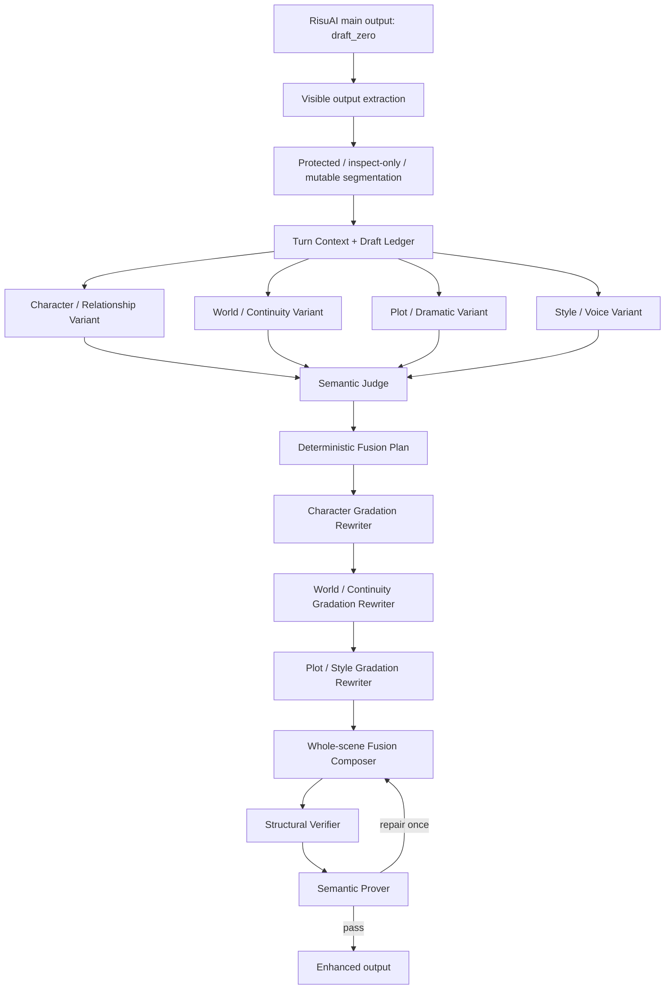

# Risu Recomposer GRADIA / MDASH 참조 및 채택 계획

- 작성일: 2026-07-30
- 대상 런타임: `source/Risu Recomposer.js`
- 현재 기준 버전: `0.1.31`
- 참조 파일: `_archive/reference/external-examples/example/GRADIA.js` `v0.24.18`
- 문서 성격: 외부 예제의 강점 분석, MDASH식 다중 AI 재작성 토폴로지, 후속 구현 순서

## 1. 결론

Risu Recomposer의 목표는 하나의 모델이 만든 응답을 몇 군데 교정하는 플러그인이 아니다.

목표는 다음과 같다.

> RisuAI 메인 모델의 출력을 `draft_zero`로 보고, 서로 다른 전문성을 가진 다수의 AI가 장면 전체의 재작성 후보와 단계별 개선본을 만든다. 별도 Judge가 후보의 사실성과 품질을 판정하고, 하나의 Fusion Composer가 장면을 새로 통합 작성하며, Semantic Prover가 최종 결과를 증명한 뒤 실제 출력으로 반환한다.

GRADIA에서 가장 참고할 부분은 역할 이름이나 프롬프트 문구가 아니다.

- 각 유료 호출이 실제 완성 원고를 만든다.
- 다음 단계는 직전 단계의 완성 원고를 이어받는다.
- 실패한 단계 하나 때문에 이전의 정상 원고까지 잃지 않는다.
- 경량과 중량 모드의 호출 증가 이유가 분명하다.
- 문맥, 역할, 모델, 실행 순서와 결과 계보를 한 턴 안에서 고정한다.

Recomposer는 이 원리를 MDASH, Fusion, Fugu와 결합한다.

- MDASH: 여러 전문 모델이 같은 초안을 각자의 능력으로 실질 재작성한다.
- Fusion: 독립 후보의 장점을 판정하고 하나의 새 장면으로 합성한다.
- Fugu: 장면 신호와 실행 상태에 따라 필요한 역할과 호출 경로를 결정한다.
- GRADIA 참조점: 완성 초안 소유권, 직렬 gradation, 마지막 정상 초안 계승, 호출 모드의 명확성.

## 2. 참조 원칙

GRADIA는 외부 예제다.

다음 항목은 가져오지 않는다.

- 함수와 클래스
- 프롬프트 문장
- JSON schema와 상수
- UI 구성 코드
- provider adapter 구현
- 로어북 검색 구현
- 저장소 키와 migration 코드

참고하는 것은 다음 설계 원리뿐이다.

- 완성 초안을 역할 사이의 주 전달물로 사용
- 독립 단계와 의존 단계를 구분
- 역할별 모델과 문맥 예산
- 경량 1호출과 중량 분석·작성 분리
- host retry에서 같은 작업을 중복 호출하지 않는 실행 계보
- 최종 장면 언어와 visible prose 계약
- 실패 시 마지막 정상 초안을 유지하는 stage fallback

## 3. GRADIA에서 확인한 강점

### 3.1 완성 초안 중심의 직렬 재작성

GRADIA의 기본 실행은 다음과 같다.

```text
SHADOW ACT
-> Character AIDE
-> World AIDE
-> Plot AIDE
-> RisuAI main response model
```

각 단계는 findings나 조언만 넘기지 않는다.

- SHADOW ACT가 한 턴의 첫 완성 장면을 쓴다.
- Character AIDE는 직전 장면 전체를 인물 기준으로 다시 쓴다.
- World AIDE는 그 결과를 세계관과 연속성 기준으로 다시 쓴다.
- Plot AIDE는 인과, 긴장, 속도와 다음 턴 개방성을 기준으로 다시 쓴다.

이 구조의 장점은 역할 호출 수와 실제 출력 변화가 직접 연결된다는 점이다.

### 3.2 호출 모드의 의미가 명확함

GRADIA의 경량과 중량 모드는 단순히 역할 수를 줄이는 옵션이 아니다.

- Lightweight: 한 호출에서 분석과 완성 재작성을 함께 수행
- Heavyweight: 분석 호출과 완성 재작성 호출을 분리

중량 모드는 호출이 늘어나는 이유가 분명하다. 별도 분석 결과가 같은 역할의 작성 호출에 강한 계약으로 전달된다.

### 3.3 역할별 실행 환경

각 작성 단계는 독립적으로 다음을 가질 수 있다.

- provider
- model
- reasoning 설정
- timeout
- output budget
- 최근 대화 범위
- 참고 문맥 범위
- prompt addendum

프론티어 모델, 저비용 모델, 로컬 모델 중 어느 한 등급도 강제하지 않는다.

### 3.4 RisuAI 문맥 활용

GRADIA는 다음 문맥을 구분한다.

- RisuAI가 실제 선택한 활성 로어
- 활성화 키를 독립 판정한 로어
- 장면 유사도까지 확장한 로어
- 캐릭터 로어와 모듈 로어
- Author Note
- HypaV3 장기 연속성
- 제외해야 할 로어와 기억 레코드

기본값이 RisuAI가 이미 선택한 로어를 재사용하는 방식이라는 점도 중요하다. 같은 턴에 로어를 다시 검색하여 과매칭하는 문제를 줄인다.

### 3.5 실행 계보와 host retry 재사용

GRADIA는 현재 입력 hash, 실행 ID, 직전 단계 draft hash를 추적한다.

같은 RisuAI 요청이 provider retry로 반복되면 이미 만든 최종 초안을 재사용한다. 동일한 멀티 에이전트 파이프라인을 다시 호출하지 않는다.

### 3.6 실사용 운영 기능

- 단계별 진행 상태
- 취소
- 입력 재구성 확인
- 고정 출력 언어
- planning/reasoning 흔적 제거
- provider별 response 형식 처리
- 설정 import/export
- 실행 결과와 단계별 초안 비교

이 기능들은 문학적 품질 자체보다 멀티 호출 플러그인을 실제로 운용할 수 있게 만드는 강점이다.

## 4. 그대로 채택하지 않을 부분

### 4.1 전 구간 직렬 실행

모든 역할을 직렬화하면 서로 독립적인 분석과 후보 생성까지 순차 대기하게 된다.

Recomposer는 다음처럼 나눈다.

- 서로 독립적인 문맥 Planner와 specialist variant는 병렬 가능
- 직전 원고를 이어받는 gradation rewriter는 직렬
- Judge 이후 Composer와 Prover는 의존 관계이므로 직렬

### 4.2 RisuAI 메인 모델에 최종 소유권 재양도

GRADIA의 강한 재작성 결과는 beforeRequest에서 메인 모델에 전달된다. 메인 모델이 그 초안을 다시 작성하면서 일부 개선을 되돌릴 수 있다.

Recomposer는 afterRequest에서 작동한다.

- RisuAI 메인 출력이 `draft_zero`
- Recomposer Composer가 최종 visible prose의 유일한 작성자
- Semantic Prover 통과 결과를 실제 반환

최종 문장 소유권은 Recomposer에 유지한다.

### 4.3 JavaScript 장기 기억 소유

Standalone에서는 RisuAI 로어북과 Hypa/Supa/current-chat memory를 읽는다.

Archive Center 연결 상태에서는 다음을 JavaScript에서 다시 선택하지 않는다.

- MariaDB canonical truth
- ChromaDB 후보 검색
- 장기 사건과 플롯 기억
- 인물별 주관 기억
- identity와 alias
- 관계와 reveal 상태
- Critic이 만든 이전 수용 근거
- Supervisor 지침

위 정보는 Archive Center Go가 선택한 read-only 계약으로 받는다.

### 4.4 파일 크기와 UI 구조

GRADIA는 약 735KB의 minified 단일 파일이다. 크기 자체는 채택 근거가 아니다.

Recomposer는 실행 품질과 직접 관계없는 호환 코드, 중복 UI, 과도한 debug API를 추가하지 않는다.

## 5. 목표 실행 구조



이 구조에는 두 종류의 다중 AI가 있다.

1. 병렬 variant AI
   - 같은 `draft_zero`를 서로 다른 전문성으로 전면 재작성한다.
   - 후보 다양성과 Fusion 재료를 만든다.
2. 직렬 gradation AI
   - Judge가 채택한 요구를 기준으로 직전 완성 원고를 단계적으로 강화한다.
   - 앞 단계의 개선을 다음 단계가 실제 문장에 이어서 반영한다.

Fusion Composer는 후보를 단순 연결하지 않는다. 전체 계보와 Fusion Plan을 읽고 하나의 새 장면을 작성한다.

## 6. 역할 구성

### 6.1 Input Planner Wave

서로 독립적으로 병렬 실행한다.

1. Canon / Secret Planner
   - 확정 사실
   - identity와 alias
   - reveal 상태
   - 작가 전용 비밀
   - 인물별 지식 범위
2. Character / Relationship Planner
   - 인물 목표와 감정
   - 관계 상태와 권력 균형
   - 대사와 행동 경계
3. Scene / Continuity Planner
   - 시간과 장소
   - 인물 위치
   - 진행 중 행동
   - 미해결 장면 약속

세 결과는 하나의 `turn_contract`와 Draft Ledger로 합친다.

### 6.2 Parallel Specialist Variants

각 역할은 장면 전체 후보를 반환한다.

1. Character / Relationship Rewriter
2. World / Continuity Rewriter
3. Plot / Dramatic Rewriter
4. Style / Voice Rewriter

장면에 따라 추가 가능한 specialist:

- Secret / Identity Continuity
- Dialogue / Subtext
- Action / Spatial Logic
- Era / Register

추가 specialist도 findings 전용 역할로 만들지 않는다. 선택되었다면 완성 장면 후보를 제출해야 한다.

### 6.3 Semantic Judge

Judge는 prose를 쓰지 않는다.

- 후보별 실제 품질 향상
- 보존된 사실과 누락된 비트
- 근거 있는 추가와 근거 없는 추가
- 비밀, POV, identity, agency 위반
- 후보 사이의 consensus, complement, conflict
- gradation 단계에서 반드시 반영할 기여 항목

### 6.4 Gradation Rewriters

직렬 단계는 무조건 세 역할을 호출하지 않는다. Fusion Plan이 실제 기여를 요구하는 단계만 실행한다.

각 단계 계약:

- 입력은 직전 완성 원고 하나
- Judge가 채택한 해당 역할 요구
- Draft Ledger
- 이전 단계가 이미 반영한 기여 목록
- 출력은 전체 mutable 장면의 새 완성본
- 조언, findings-only, 빈 patch 금지

### 6.5 Whole-scene Fusion Composer

Composer는 다음을 받는다.

- `draft_zero`
- 병렬 specialist 후보
- Judge 판정
- Fusion Plan
- gradation 단계별 완성 원고
- Draft Ledger
- 보호 구조 지도

Composer는 최종 visible prose의 유일한 소유자다.

### 6.6 Semantic Prover

Composer와 다른 모델을 기본으로 한다.

- 확정 사실
- 장면 비트
- identity와 reveal
- 인물별 지식
- 주관 기억의 시점
- 사용자 agency
- 관계와 감정
- 세계와 플롯 연속성
- 문체, 반복, 설명 과잉, 장면 결말
- 선택된 역할 기여의 실제 실현

## 7. 실행 프로필과 호출 예산

다량의 AI를 사용한다는 목표를 유지하되, 호출 하나마다 실제 역할을 갖게 한다.

### 7.1 Balanced

- Input Planner 2~3, 병렬
- Specialist Variant 2~3, 병렬
- Judge 1
- Gradation Rewriter 0~1
- Composer 1
- Prover 1
- 필요 시 Repair 1

정상 7~9회, 최대 10회.

### 7.2 Quality

- Input Planner 3, 병렬
- Specialist Variant 4, 병렬
- Judge 1
- Gradation Rewriter 2
- Composer 1
- Prover 1
- 필요 시 Repair 1

정상 12회, 최대 13회.

### 7.3 MDASH Full

- Input Planner 3, 병렬
- Specialist Variant 5, 병렬
- Cross-review Critic 2, 병렬
- Domain Judge 1
- Gradation Rewriter 2~3
- Final Composer 1
- Semantic Prover 1
- 필요 시 Repair와 재검증 1~2

정상 15~16회, 최대 18회.

### 7.4 초기 55회 구상의 위치

초기 계획에는 최대 55회 호출을 사용하는 대규모 구성이 있었다.

이 숫자는 비용이나 호출 수를 제한하지 않았던 초기 탐색 범위를 보여주는 참고치이며, 현재의 권장 실행 프로필이 아니다.

현재 목표는 55개 역할을 유지하는 것이 아니라 다음 능력을 더 적은 호출로 보존하는 것이다.

- 서로 다른 전문 모델의 후보 다양성
- 역할 간 전체 원고 재작성
- 후보의 교차 판정과 Fusion
- 인물별 Table Read escalation
- 최종 의미 증명

한 모델이 인접한 두 기능을 충분히 수행할 수 있으면 묶는다. 서로 충돌하거나 독립성이 필요한 판정과 작성은 분리한다.

55회 상당의 역할을 다시 활성화하는 경우는 일반 profile이 아니라 연구·진단용 실행으로 한정한다. 호출을 늘렸을 때 실제 품질 우위가 전후 비교로 증명되지 않으면 제품 프로필에 포함하지 않는다.

MDASH Full은 중요한 장면용 명시적 profile이다. 역할을 단순히 많이 켜는 debug mode가 아니다.

모든 프로필에서 프론티어 모델과 저비용 모델을 제한하지 않는다. 사용자가 각 역할에 어떤 모델이든 배치할 수 있어야 한다.

## 8. 병렬과 직렬 실행 규칙

### 병렬 가능

- Input Planner 상호 간
- Specialist Variant 상호 간
- 서로 다른 endpoint의 독립 호출

### 직렬 필수

- Judge 이후 Fusion Plan
- 직전 완성 원고를 받는 Gradation Rewriter
- Composer
- Structural Verifier
- Semantic Prover
- Repair Composer와 재검증

### Provider backpressure

- endpoint 기준으로 그룹화
- 같은 endpoint 호출 수가 임계값을 넘으면 해당 그룹만 직렬 또는 제한 병렬
- 다른 endpoint 그룹은 병렬 유지
- host retry는 동일 turn fingerprint의 결과를 재사용
- 사용자 취소와 deadline은 대기열과 active request를 함께 중단

## 9. Standalone과 Archive Center 연결

### 9.1 Standalone

Recomposer가 직접 수집한다.

- payload system
- 최근 대화와 최신 사용자 입력
- 캐릭터와 페르소나
- 현재 채팅
- RisuAI 활성 로어
- Supa/Hypa/current-chat memory

### 9.2 Archive Center 감지

Archive Center Go가 제공하는 계약을 우선한다.

- 객관적 사건과 인물 상태
- 세계 상태
- 인물별 주관 기억
- 작가 전용 비밀
- unresolved goal
- 현재 턴 Supervisor 지침
- 이전에 수용·검증된 Critic direct evidence

주관 기억은 객관적 사실로 승격하지 않는다. 비밀은 등장인물의 공유 지식으로 사용하지 않는다.

Archive Center packet이 제공한 필드를 standalone 수집기가 다시 진실 판정하지 않는다. packet이 unavailable로 표시한 필드만 standalone 문맥으로 보완한다.

### 9.3 추후 Table Read

Table Read는 Archive Center의 인물별 주관 기억이 연결된 이후 중요한 장면에서만 escalation한다.

- 등장인물마다 별도 AI를 하나 배치
- 각 AI는 해당 인물의 기억, 오해, 비밀 지식 범위와 관계 상태만 받음
- 자기 인물 관점에서 현재 장면의 대사와 행동을 평가
- 결과는 공유 사실이 아니라 perspective-scoped contribution
- Judge가 충돌을 판정하고 Composer가 최종 장면에 반영

## 10. 실패와 반환 규칙

### Stage failure

- 실패 단계만 제외
- 마지막 정상 완성 원고를 다음 단계에 전달
- 성공한 다른 specialist와 gradation 결과를 폐기하지 않음

### Schema failure

- 1회 compact structured recovery
- 그래도 실패하면 해당 역할만 제외

### Composer failure

- Composer 1회 recovery
- recovery도 실패하면 Judge가 승인한 마지막 완성 gradation 원고를 검사 대상으로 사용

### Prover 결과

1. `pass`
   - enhanced output 반환
2. `repair`
   - 위반 항목만 전달해 Composer 1회 수정
3. `fatal_violation`
   - protected 구조, 비밀 공개, identity/agency/canon 중대 위반이면 원문 반환
4. `quality_shortfall`
   - 구조와 의미 불변조건은 통과했지만 향상이 약한 경우
   - 원문으로 자동 회귀하지 않고 Judge가 승인한 최상위 완성 후보를 반환 가능

원문 반환은 중대한 계약 파손에 사용한다. 단순히 변화가 크거나 모델 하나가 실패했다는 이유로 전체 개선을 취소하지 않는다.

## 11. Trace 계약

Trace는 호출 수보다 실제 기여를 보여줘야 한다.

각 호출:

- role
- provider/model
- endpoint group
- queue/start/end/duration
- retry/fallback
- input draft hash
- output draft hash
- changed character count
- structured recovery

각 단계:

- 전체 전/후 문장
- 새로 반영한 역할 기여
- 유지한 이전 단계 기여
- 누락하거나 거부한 항목과 이유

최종:

- `draft_zero`
- 병렬 후보 수
- Judge 승인/거부
- 실행된 gradation 단계
- Composer 통합 기여
- Prover 결과
- 실제 반환 상태
- 전체 전/후 비교

`Enhanced=true`만으로 품질 향상을 주장하지 않는다. 어떤 역할의 어떤 기여가 최종 문장에 남았는지를 증명한다.

## 12. 구현 순서

### Phase G1. GRADIA 참조 계약 고정

- 이 문서를 현재 채택 기준으로 사용
- 외부 코드와 프롬프트 비복제 원칙 고정
- 기존 minimal-patch 역사 문구와 정상 Writer 경로 분리

### Phase G2. Full-scene Revision Schema

- `full_scene_revision.v2`
- input draft hash
- complete mutable scene
- retained ledger IDs
- added ledger proposals
- realized role contributions
- output language

### Phase G3. Specialist 강제 계약

- findings-only 성공 금지
- 선택된 역할은 완성 장면 후보 제출
- 빈 후보와 원문 복사는 failure-to-improve로 분류

### Phase G4. Gradation Ladder

- Judge 판정을 입력으로 받는 직렬 rewriter
- 마지막 정상 초안 계승
- 단계별 기여 보존
- Quality와 MDASH Max에서 활성화

### Phase G5. Fusion Composer 확장

- 병렬 후보와 gradation 원고를 동시에 비교
- 후보 문장 복사보다 새 통합 장면 작성
- 선택된 역할 기여 실현 목록 반환

### Phase G6. Prover 결과 분리

- fatal violation
- repairable violation
- quality shortfall
- pass

quality shortfall과 중대 계약 위반을 같은 원문 fallback으로 처리하지 않는다.

### Phase G7. Scheduler와 Retry Reuse

- endpoint group backpressure
- 동일 요청 fingerprint 재사용
- active call 종료 보장
- cancel과 completion wait

### Phase G8. Trace와 비교 UI

- 단계별 전체 전/후
- 역할 기여
- 최종 전체 전/후
- 저장하지 않는 현재 턴 비교 탭

### Phase G9. 실사용 검증

- Balanced 3턴
- Quality 3턴
- MDASH Max 중요 장면 2턴
- 단일 provider
- 복수 provider
- Archive Center 없음
- Archive Center 연결

## 13. Acceptance Criteria

### 실행

- 선택된 specialist의 80% 이상이 완성 장면 후보를 반환
- 같은 endpoint backpressure에서 무한 대기 없음
- host retry에서 전체 파이프라인 중복 호출 없음
- 단계 실패 후 마지막 정상 초안으로 계속 진행

### 실제 변화

- 선택된 역할 기여 중 최소 2개 이상이 최종 문장에 확인됨
- Quality와 MDASH Max에서 원문 복사 비율이 설정된 상한을 넘으면 failure-to-improve
- 단순 길이 축소나 오탈자 수정만으로 품질 성공 판정 금지
- 전체 전/후 비교에서 장면 구조, 인물 반응, 전개 또는 문체 중 복수 축이 개선됨

### 서사 계약

- 확정 사실 보존
- 비밀과 reveal 상태 보존
- identity와 alias 보존
- POV와 인물 지식 보존
- 사용자 agency 보존
- 관계와 주관 기억의 관점 보존
- 근거 없는 설정 추가 금지
- 다음 턴 선택 가능성 유지

### 구조

- protected와 inspect-only exact preservation
- reasoning/planning artifact 미노출
- Markdown, code fence, HTML/tag 구조 유지
- 이미지와 상태창 유지

## 14. 최종 결정

Risu Recomposer는 GRADIA를 복제하지 않는다.

GRADIA에서 채택할 핵심은 다음 한 문장으로 정리한다.

> 전문 AI를 호출했다면 그 AI는 조언만 남기지 않고 현재 완성 원고를 실제로 더 강하게 다시 써야 한다.

Recomposer는 여기에 MDASH의 다수 전문 모델, Fusion의 독립 후보 합성, Fugu의 선택적 라우팅, Semantic Judge와 Prover, Archive Center의 장기·주관 기억을 결합한다.

초기 55회 구상의 전문 분업 능력은 유지하되, 중복 분석과 효과가 없는 호출은 합치거나 제거한다. 동일하거나 더 높은 품질을 더 적은 호출로 만들고, 각 AI의 전문성이 최종 문장에 남았는지를 전체 전후 비교와 역할별 기여로 확인할 수 있는 재구성 엔진을 목표로 한다.
